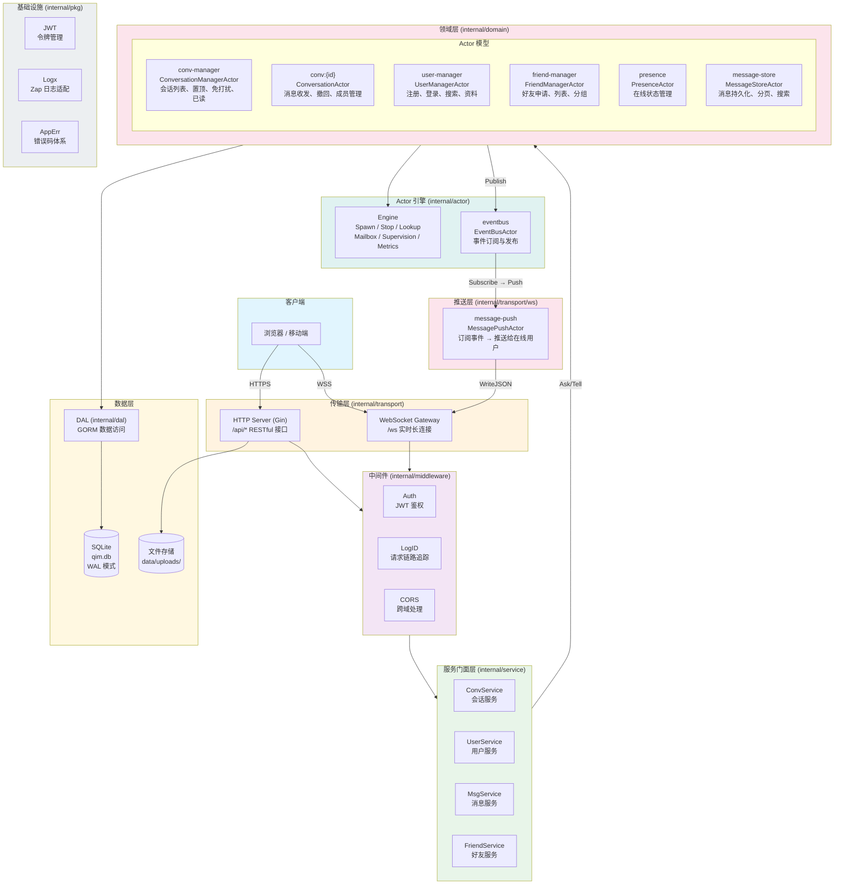
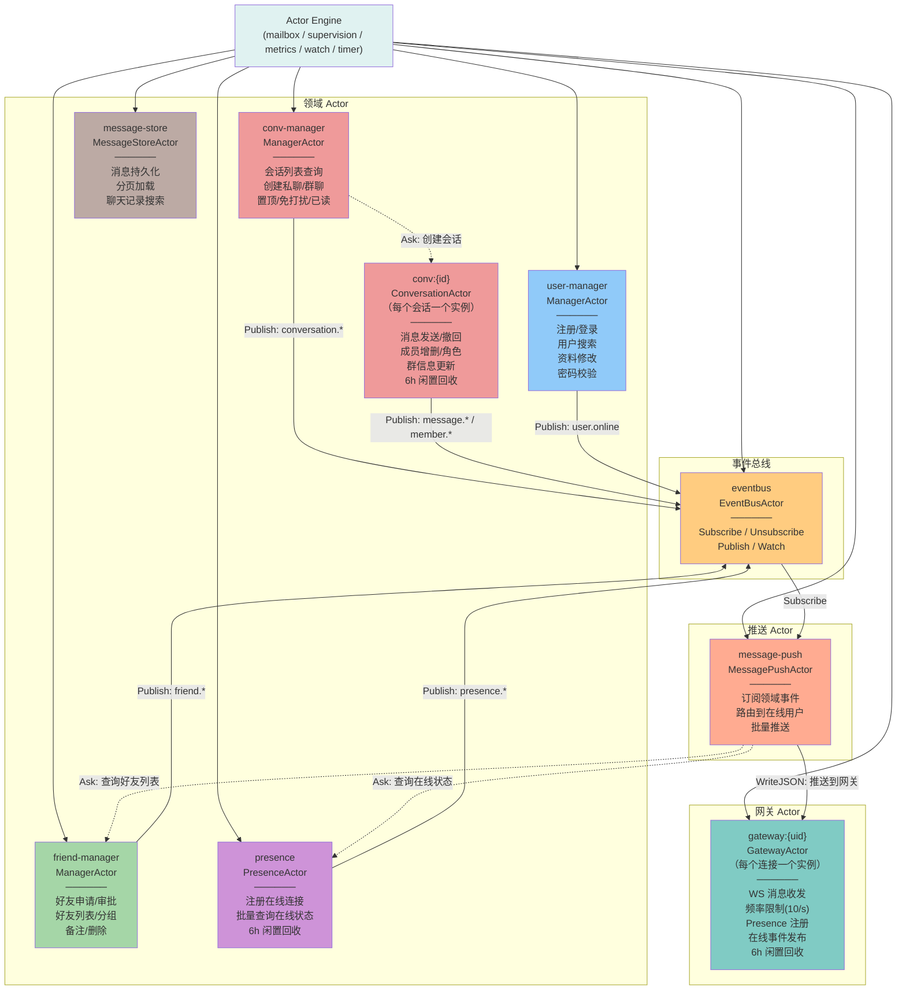
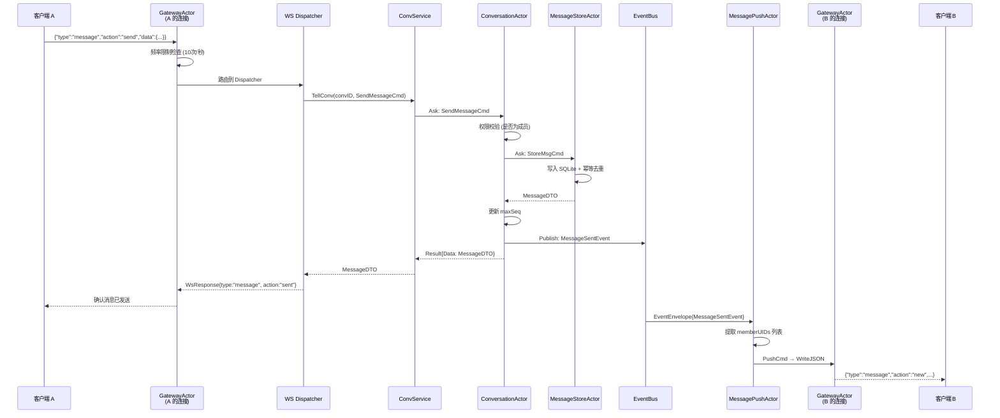
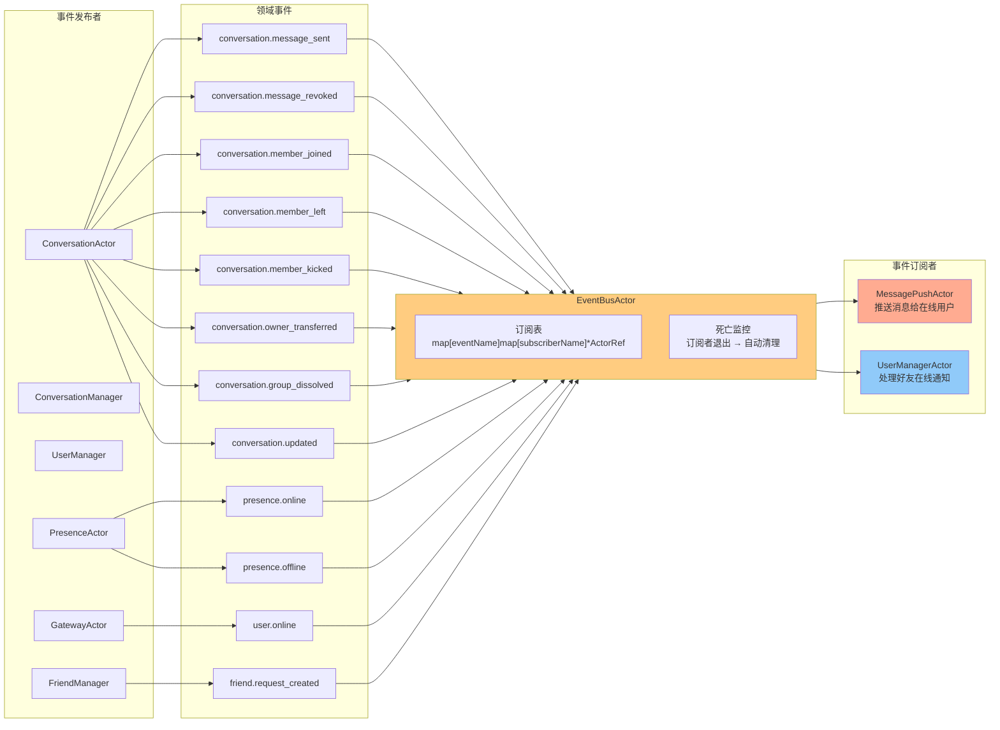
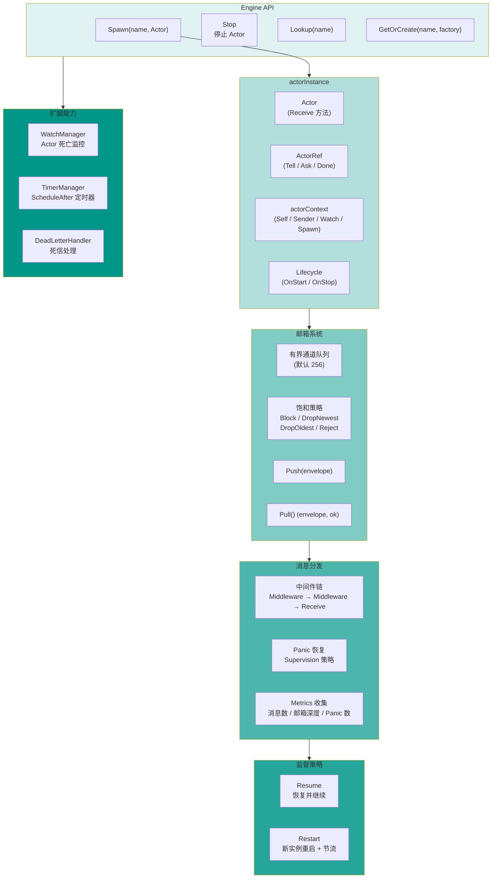

# QIM 后端架构

## 一、分层架构总览



---

## 二、Actor 模型全景



---

## 三、消息发送全链路



---

## 四、事件驱动体系



---

## 五、Actor 引擎内部结构



---

## 六、目录结构与分层映射

```
backend/
├── cmd/server/                入口 → app.go: 依赖初始化、启动服务
│
├── internal/
│   ├── transport/             传输层
│   │   ├── http/              ── Gin Handler，参数解析，调用 Service
│   │   ├── ws/                ── WebSocket Gateway、Dispatcher、PushHandler
│   │   └── server.go          ── 路由注册、中间件挂载
│   │
│   ├── service/               服务门面层
│   │   ├── conv_service.go    ── AskConv / AskManager / TellConv
│   │   ├── user_service.go    ── 用户 Actor 的 Ask 封装
│   │   ├── msg_service.go     ── 消息 Actor 的 Ask 封装
│   │   └── friend_service.go  ── 好友 Actor 的 Ask 封装
│   │
│   ├── domain/                领域层 (Actor 实现)
│   │   ├── conversation/      ── ConversationActor + ManagerActor + Store + Events
│   │   ├── friend/            ── FriendManagerActor + Events
│   │   ├── message/           ── MessageStoreActor
│   │   ├── presence/          ── PresenceActor
│   │   └── user/              ── UserManagerActor + Events
│   │
│   ├── eventbus/              事件总线
│   │   └── actor_bus.go       ── EventBusActor (订阅/发布/Watch)
│   │
│   ├── actor/                 Actor 引擎 (自研)
│   │   ├── engine.go          ── Spawn / Stop / Lookup / GetOrCreate
│   │   ├── actor.go           ── Actor 接口 + ActorRef (Tell/Ask)
│   │   ├── context.go         ── Context 接口 (Self/Sender/Watch/Spawn)
│   │   ├── mailbox.go         ── 有界队列 + 4 种饱和策略
│   │   ├── option.go          ── EngineOption 函数式配置
│   │   ├── metrics.go         ── Metrics 接口 + 默认实现
│   │   ├── middleware.go      ── 消息中间件链
│   │   ├── timer.go           ── ScheduleAfter 定时器
│   │   ├── watch_manager.go   ── Actor 死亡监控
│   │   ├── dead_letter.go     ── 死信处理
│   │   ├── signal.go          ── PoisonPill / Terminated
│   │   ├── future.go          ── Ask 模式的 Future 实现
│   │   └── errors.go          ── 引擎级错误定义
│   │
│   ├── dal/                   数据访问层
│   │   ├── models.go          ── GORM Model 定义
│   │   ├── user_store.go      ── 用户 CRUD
│   │   ├── conv_store.go      ── 会话/成员 CRUD
│   │   ├── msg_store.go       ── 消息 CRUD + 幂等索引
│   │   └── friend_store.go    ── 好友 CRUD
│   │
│   ├── middleware/             HTTP 中间件
│   │   ├── auth.go            ── JWT 鉴权 + 上下文注入
│   │   └── logid.go           ── LogID 生成与响应头注入
│   │
│   └── pkg/                   通用基础设施
│       ├── jwt/               ── JWT 签发与校验
│       ├── logx/              ── Zap 日志 + Actor Logger 适配
│       ├── apperr/            ── 错误码体系 (code + message)
│       └── resp/              ── HTTP 响应封装
```

---

## 七、关键设计决策

| 决策 | 说明 |
|------|------|
| Actor 模型管理状态 | 每个会话/用户/好友的状态串行化到对应 Actor，消除锁竞争 |
| Ask/Tell 模式 | 同步请求用 Ask（带 5s 超时），异步通知用 Tell |
| 6 小时闲置回收 | ConversationActor / PresenceActor / GatewayActor 超时自动 PoisonPill |
| EventBus 解耦推送 | 领域 Actor 只发布事件，MessagePushActor 订阅后负责推送 |
| Service 门面层 | HTTP/WS Handler 不直接操作 Actor，通过 Service 层的 Ask/Tell 封装 |
| 函数注入解耦 | Service 通过 `newConvFn` 工厂函数获取 Actor，不直接 import domain 包 |
| SQLite WAL 模式 | 提升并发读性能，`busy_timeout=5000` 避免锁冲突 |
| 消息幂等去重 | `(conversation_id, client_id)` 联合唯一索引，防止重复提交 |
| Logger 接口解耦 | Actor 引擎只依赖 `actor.Logger` 接口（一个 Printf 方法），通过适配器桥接 Zap |