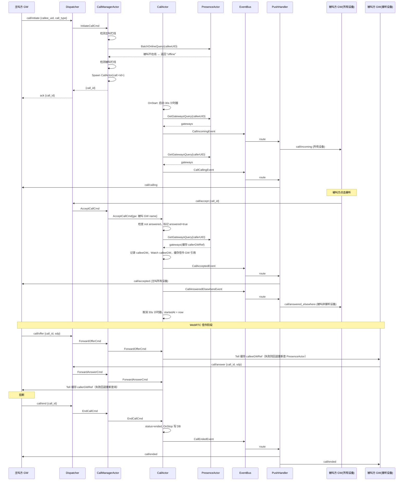

需求文档：[01-音视频通话一期-单人私聊音视频](../../requirements/01-音视频通话一期-单人私聊音视频.md)

# 音视频通话一期：1对1私聊音视频 - 后端技术方案

## 一、需求分析

### 1.1 需求背景与目标

QIM 当前仅支持文字和图片消息，缺少实时音视频沟通能力。本期在私聊会话中新增语音通话和视频通话功能，核心目标：
- 支持 1对1 语音/视频呼叫、接听、拒绝、挂断
- WebRTC 信令（offer/answer/ICE）的透传与转发
- 忙线检测、不在线检测、30s 超时、多设备互斥接听
- 通话记录持久化（OnStop 写入 DB）

### 1.2 现状分析

| 环节 | 现状 | 缺失 |
|------|------|------|
| `domain/call/` | **不存在** | 全新的通话域，需新建 CallManagerActor + CallActor |
| DAL `models.go` | 无 Call 模型 | 需新增 `Call` 表 |
| DAL Store | 无 CallStore | 需新增 `CallStore` 接口与 GORM 实现 |
| `service/` | 无 CallService | 需新增 `CallService` |
| `transport/ws/handler.go` | 仅路由 conv/msg/friend/user/presence | 需新增 `"call"` 类型 + `callRouter` |
| `transport/ws/push_handler.go` | `routePushEvent` 无 call 事件 | 需新增 call 事件路由 |
| `eventbus/` | 无 call 事件 | 需新增 CallIncoming/CallAccepted 等事件 |
| PresenceActor | 支持 `GetGatewaysQuery` | **可直接复用**，信令转发依赖此接口 |

可复用能力：
- Actor 框架：Spawn、Watch（监听 GW 断开）、ScheduleAfter（超时计时器）、GetOrCreate
- PresenceActor：`GetGatewaysQuery` 获取用户所有 Gateway 引用
- PushHandler：`pushToUser(uid, type, action, data)` 按用户全设备推送
- EventBus：发布/订阅领域事件
- 现有 WS 协议框架：`WsRequest` + `WsResponse` + `Dispatcher` 模式

### 1.3 核心问题与约束

1. **忙线检测**：同一用户同一时刻只能参与一通电话，需 CallManagerActor 维护 `uid → callID` 映射
2. **信令与通知分离**：offer/answer/ICE 走 Actor 直连（CallActor→缓存的 GW 引用），状态通知走 EventBus → PushHandler（遵循 agent.md 推送架构规则）
3. **多设备互斥**：所有设备同时振铃，仅第一个 accept 生效，其余收到 `answered_elsewhere`（独立事件，见 #3.4）
4. **GW 断线检测**：通过 `ctx.Watch` 监听信令 GW，不同阶段不同处理（见 #3.8 状态机）
5. **通话记录**：OnStop 写入 DB，`duration = (startedAt > 0 ? endedAt - startedAt : 0)`
6. **CallActor 监督策略**：使用 `StrategyStop`，panic 后不 Resume（状态机已损坏，Resume 可能导致计时器紊乱）
7. **TOCTOU 容忍**：忙线/在线检测与 Spawn CallActor 之间极小的时间窗口，在单 Actor 串行处理模型下不构成实际威胁，属于已知可接受限制

## 二、系统概要设计

### 2.1 架构设计

新增 `domain/call/` 域，包含两个 Actor：

```
┌─────────────────────────────────────────────────────────────────────┐
│                     domain/call/                                     │
│                                                                      │
│  CallManagerActor (call-manager)                                     │
│  ├── busy: map[uid]callID        # 忙线映射                          │
│  ├── CallActorRefs: map[string]*ActorRef  # callID → CallActor       │
│  ├── 职责：创建/查找通话、忙线检测、转发信令到 CallActor              │
│  └── Watch 所有 CallActor，Terminated 时自动清理 busy 映射            │
│                                                                      │
│  CallActor (call:<callID>)       # 单通电话的状态机                   │
│  ├── Status: ringing → connected → ended                             │
│  ├── Supervision: StrategyStop（panic 即停止，不 Resume）                │
│  ├── 职责：超时控制、GW 断线检测、信令转发（缓存 ref + 失败回退）、发布事件   │
│  └── OnStop 时写入 Call 记录到 DB                                    │
└─────────────────────────────────────────────────────────────────────┘
```

### 2.2 时序图



### 2.3 数据流图

```
前端 WS ──call/initiate──► Dispatcher ──InitiateCallCmd──► CallManagerActor
                                                              │
                                              ┌───────────────┤
                                              │               │
                                              ▼               ▼
                                      忙线/在线检测        Spawn CallActor
                                              │               │
                                              │               ▼
                                              │         OnStart: 30s timer
                                              │         GetGateways(callee) → Push incoming
                                              │         Watch callerGW / calleeGW
                                              │               │
                                              ▼               ▼
                               ┌──── accept/reject/cancel/end ────┐
                               │                                  │
                               ▼                                  ▼
                        CallActor 状态变迁               EventBus.Publish
                               │                                  │
                    ┌──────────┴──────────┐                      ▼
                    │                     │              PushHandler.route
                    ▼                     ▼                      │
          信令直连(GW→GW)         EventBus 通知           pushToUser(...)
          offer/answer/ice       accepted/rejected       call/ended 等
                                 ended/timeout
```

### 2.4 推送策略

| 消息类型 | 推送方式 | 推送对象 | action | 说明 |
|---------|---------|---------|--------|------|
| 来电通知 | EventBus → PushHandler | 被叫所有设备 | `incoming` | 事实通知 |
| 呼叫中 | EventBus → PushHandler | 主叫所有设备 | `calling` | 事实通知 |
| 已接听 | EventBus → PushHandler | 主叫所有设备 | `accepted` | 事实通知 |
| 已拒绝 | EventBus → PushHandler | 主叫所有设备 | `rejected` | 事实通知 |
| 已取消 | EventBus → PushHandler | 被叫所有设备 | `cancelled` | 事实通知 |
| 已结束 | EventBus → PushHandler | 双方所有设备 | `ended` | 事实通知 |
| 已超时 | EventBus → PushHandler | 双方所有设备 | `timeout` | 事实通知 |
| 多设备互斥 | EventBus → PushHandler | 被叫其他设备 | `answered_elsewhere` | 事实通知 |
| offer SDP | **Actor 直连** | 被叫信令 GW | `offer` | 指令/数据 |
| answer SDP | **Actor 直连** | 主叫信令 GW | `answer` | 指令/数据 |
| ICE candidate | **Actor 直连** | 对方信令 GW | `ice` | 指令/数据 |
| 忙线/不在线 | WS Sync Reply | 发起方当前 GW | `error` | 同步错误响应 |

## 三、系统详细设计

### 3.1 WS 协议

#### 上行

```json
// 发起通话
{"type":"call","action":"initiate","data":{"callee_uid":200,"call_type":1}}

// 接听（被叫方指定设备）
{"type":"call","action":"accept","data":{"call_id":"call_xxx"}}

// 拒绝
{"type":"call","action":"reject","data":{"call_id":"call_xxx"}}

// 取消（主叫方在 ringing 阶段取消）
{"type":"call","action":"cancel","data":{"call_id":"call_xxx"}}

// 挂断（connected 阶段任一方挂断）
{"type":"call","action":"end","data":{"call_id":"call_xxx"}}

// WebRTC 信令
{"type":"call","action":"offer","data":{"call_id":"call_xxx","sdp":"..."}}
{"type":"call","action":"answer","data":{"call_id":"call_xxx","sdp":"..."}}
{"type":"call","action":"ice","data":{"call_id":"call_xxx","candidate":"...","sdp_mid":"...","sdp_m_line_index":0}}
```

| 字段 | 类型 | 必填 | 说明 |
|------|------|------|------|
| `callee_uid` | `number` | initiate 必填 | 被叫用户 UID |
| `call_type` | `1\|2` | initiate 必填 | 1=语音通话，2=视频通话 |
| `call_id` | `string` | 除 initiate 外必填 | 通话 ID，由服务端返回 |
| `sdp` | `string` | offer/answer 必填 | SDP 描述 |
| `candidate` | `string` | ice 必填 | ICE candidate |
| `sdp_mid` | `string` | ice 选填 | Media stream ID |
| `sdp_m_line_index` | `number` | ice 选填 | Media line index |

#### 下行（PushHandler 推送 / 信令直连）

```json
// 被叫方：来电通知
{"type":"call","action":"incoming","data":{"call_id":"call_xxx","caller_uid":100,"call_type":1,"caller_nickname":"张三","caller_avatar":"xxx"}}

// 主叫方：呼叫中
{"type":"call","action":"calling","data":{"call_id":"call_xxx","callee_uid":200}}

// 主叫方：对方已接听
{"type":"call","action":"accepted","data":{"call_id":"call_xxx"}}

// 主叫方：对方已拒绝
{"type":"call","action":"rejected","data":{"call_id":"call_xxx"}}

// 被叫方：主叫已取消
{"type":"call","action":"cancelled","data":{"call_id":"call_xxx"}}

// 双方：通话结束
{"type":"call","action":"ended","data":{"call_id":"call_xxx","started_at":1700000000,"duration":120,"end_reason":"hangup"}}

// 双方：超时
{"type":"call","action":"timeout","data":{"call_id":"call_xxx"}}

// 被叫其他设备：已在别处接听
{"type":"call","action":"answered_elsewhere","data":{"call_id":"call_xxx"}}

// WebRTC 信令（Actor 直连）
{"type":"call","action":"offer","data":{"call_id":"call_xxx","sdp":"..."}}
{"type":"call","action":"answer","data":{"call_id":"call_xxx","sdp":"..."}}
{"type":"call","action":"ice","data":{"call_id":"call_xxx","candidate":"...","sdp_mid":"...","sdp_m_line_index":0}}

// 同步错误（忙线/不在线/自己忙线）
{"type":"error","action":"initiate","error":{"code":"call.busy","message":"对方忙线"}}
{"type":"error","action":"initiate","error":{"code":"call.offline","message":"对方不在线"}}
{"type":"error","action":"initiate","error":{"code":"call.self_busy","message":"你正在通话中"}}
{"type":"error","action":"accept","error":{"code":"call.already_answered","message":"已在其他设备接听"}}
```

### 3.2 数据模型

#### Call 表（新增）

```go
type Call struct {
    ID        uint64 `gorm:"primaryKey;autoIncrement"`
    CallerUID uint64 `gorm:"index;not null"`
    CalleeUID uint64 `gorm:"index;not null"`
    CallType  int8   `gorm:"not null"`        // 1=voice, 2=video
    Status    int8   `gorm:"not null"`        // 1=missed(未接通), 2=completed(已接通)
    StartedAt int64                            // 接通时间戳，0=未接通
    EndedAt   int64  `gorm:"not null"`
    Duration  int64                            // 通话时长(秒)，startedAt>0 ? endedAt-startedAt : 0
    EndReason string `gorm:"size:32"`          // hangup/rejected/timeout/cancelled/disconnect
    CreatedAt int64  `gorm:"autoCreateTime:milli"`
}
```

#### CallStore 接口（新增）

```go
type CallStore interface {
    Create(call *Call) error
    // 二期预留（一期返回 ErrNotImplemented 或仅存桩实现）
    GetByID(id uint64) (*Call, error)
    ListByUser(uid uint64, offset, limit int) ([]Call, error)
}
```

#### CallID 生成策略

`call_<unix_millis>_<8位随机字符串>`，例如 `call_1700000000000_a3f8c2b1`。由 CallManagerActor 在 Spawn CallActor 前生成，确保唯一性。

### 3.3 消息定义

#### call/messages.go（新增）

```go
package call

// --- 命令 ---

// InitiateCallCmd: WS → CallManagerActor
type InitiateCallCmd struct {
    CallerUID uint64
    CalleeUID uint64
    CallType  int8 // 1=voice, 2=video
}

// AcceptCallCmd: WS → CallManagerActor → CallActor
type AcceptCallCmd struct {
    CallID      string
    GatewayName string // 接听的 GW 名称
}

type RejectCallCmd struct {
    CallID string
}

type CancelCallCmd struct {
    CallID string
}

type EndCallCmd struct {
    CallID string
}

// ForwardOfferCmd / ForwardAnswerCmd / ForwardIceCmd: WS → CallManagerActor → CallActor
type ForwardOfferCmd struct {
    CallID string
    SDP    string
}

type ForwardAnswerCmd struct {
    CallID string
    SDP    string
}

type ForwardIceCmd struct {
    CallID        string
    Candidate     string
    SDPMid        string
    SDPMLineIndex int
}

// --- 内部消息 ---

// StartCallCmd: CallManagerActor → CallActor (OnStart 后发送)
type StartCallCmd struct {
    CallID    string
    CallerUID uint64
    CalleeUID uint64
    CallType  int8
    CallerGW  string // 发起方的 GW 名称
    CallerInfo CallerInfo
}

type CallerInfo struct {
    Nickname string
    Avatar   string
}

// TimeoutCallCmd: CallActor 自调度（ScheduleAfter 30s）
type TimeoutCallCmd struct{}

// --- 查询 ---

type GetCallQuery struct {
    CallID string
}

type GetCallByUserQuery struct {
    UID uint64
}

// --- 结果 ---

type Result struct {
    Data any
    Err  error
}

type InitiateResult struct {
    CallID string
}

type CallInfo struct {
    CallID    string
    CallerUID uint64
    CalleeUID uint64
    CallType  int8
    Status    string
}
```

### 3.4 事件定义

#### call/events.go（新增）

```go
package call

const (
    EventCallIncoming          = "call.incoming"
    EventCallCalling           = "call.calling"
    EventCallAccepted          = "call.accepted"
    EventCallRejected          = "call.rejected"
    EventCallCancelled         = "call.cancelled"
    EventCallEnded             = "call.ended"
    EventCallTimeout           = "call.timeout"
    EventCallAnsweredElsewhere = "call.answered_elsewhere"
)

type CallIncomingEvent struct {
    CallID       string
    CallerUID    uint64
    CalleeUID    uint64
    CallType     int8
    CallerName   string
    CallerAvatar string
}

func (CallIncomingEvent) Name() string { return EventCallIncoming }

type CallCallingEvent struct {
    CallID    string
    CallerUID uint64
    CalleeUID uint64
}

func (CallCallingEvent) Name() string { return EventCallCalling }

type CallAcceptedEvent struct {
    CallID    string
    CallerUID uint64
    CalleeUID uint64
    AcceptGW  string // 接听的 GW 名称，用于排除 answered_elsewhere 推送
}

func (CallAcceptedEvent) Name() string { return EventCallAccepted }

type CallRejectedEvent struct {
    CallID    string
    CallerUID uint64
    CalleeUID uint64
}

func (CallRejectedEvent) Name() string { return EventCallRejected }

type CallCancelledEvent struct {
    CallID    string
    CallerUID uint64
    CalleeUID uint64
}

func (CallCancelledEvent) Name() string { return EventCallCancelled }

type CallEndedEvent struct {
    CallID    string
    CallerUID uint64
    CalleeUID uint64
    StartedAt int64
    Duration  int64
    EndReason string
}

func (CallEndedEvent) Name() string { return EventCallEnded }

type CallTimeoutEvent struct {
    CallID    string
    CallerUID uint64
    CalleeUID uint64
}

func (CallTimeoutEvent) Name() string { return EventCallTimeout }

type CallAnsweredElsewhereEvent struct {
    CallID    string
    CallerUID uint64
    CalleeUID uint64
    AcceptGW  string
}

func (CallAnsweredElsewhereEvent) Name() string { return EventCallAnsweredElsewhere }
```

### 3.5 校验规则

| 序号 | 规则 | 失败行为 |
|------|------|---------|
| 1 | `call_type` 必须为 1 或 2 | 返回 `call.invalid_type` |
| 2 | 主叫方忙线（uid 在 busy map 中） | 返回 `call.self_busy` |
| 3 | 被叫方不在线 | 返回 `call.offline` |
| 4 | 被叫方忙线（uid 在 busy map 中） | 返回 `call.busy` |
| 5 | 不能给自己打电话 | 返回 `call.self_call` |
| 6 | `call_id` 不存在 | 返回 `call.not_found` |
| 7 | 接听时 call 已经不是 ringing 状态 | 返回 `call.already_answered` |
| 8 | 操作者不是通话参与者 | 返回 `call.forbidden` |

### 3.6 错误码

| 错误码 | 说明 |
|--------|------|
| `call.invalid_type` | 无效的通话类型 |
| `call.self_busy` | 你正在通话中 |
| `call.offline` | 对方不在线 |
| `call.busy` | 对方忙线 |
| `call.self_call` | 不能给自己打电话 |
| `call.not_found` | 通话不存在 |
| `call.already_answered` | 已在其他设备接听 |
| `call.forbidden` | 无权操作此通话 |
| `call.invalid_state` | 当前通话状态不允许此操作 |

### 3.7 推送路由

PushHandler `routePushEvent` 新增 call 事件路由。`CallAcceptedEvent` 与 `CallAnsweredElsewhereEvent` 是两个独立事件，CallActor 同时发布，PushHandler 分别路由，不破坏 `routePushEvent` 的统一签名：

```go
case call.CallIncomingEvent:
    return "call", "incoming", []uint64{e.CalleeUID}, e, true

case call.CallCallingEvent:
    return "call", "calling", []uint64{e.CallerUID}, e, true

case call.CallAcceptedEvent:
    return "call", "accepted", []uint64{e.CallerUID}, e, true

case call.CallAnsweredElsewhereEvent:
    // 推给被叫方除接听 GW 外的其他设备
    return "call", "answered_elsewhere", calleeOtherDeviceUIDs(e), e, true

case call.CallRejectedEvent:
    return "call", "rejected", []uint64{e.CallerUID}, e, true

case call.CallCancelledEvent:
    return "call", "cancelled", []uint64{e.CalleeUID}, e, true

case call.CallEndedEvent:
    return "call", "ended", []uint64{e.CallerUID, e.CalleeUID}, e, true

case call.CallTimeoutEvent:
    return "call", "timeout", []uint64{e.CallerUID, e.CalleeUID}, e, true
```

`CallAnsweredElsewhereEvent` 的 recipients 为被叫方所有 GW 对应的 uid（排除接听 GW），由 `calleeOtherDeviceUIDs(e)` 辅助函数计算。

**时序保证**：`initiate` 的 ack（CallManagerActor.Ask 同步返回）一定在 `calling` push 之前到达，因为 CallManagerActor 先 `ctx.Reply` 再 `Spawn`，CallActor.OnStart 的 EventBus.Publish 在独立 goroutine 中异步执行。

### 3.8 CallActor 状态机

**监督策略**：CallActor Spawn 时使用 `actor.WithSupervision(actor.StrategyStop)`。通话状态机 panic 后状态不可信，Resume 可能导致计时器紊乱，因此 panic 即停止。

```
        ┌──────────────────────────────────────────────┐
        │                   ringing                      │
        │  OnStart: StartCallCmd                        │
        │    • 启动 30s ScheduleAfter(TimeoutCallCmd)   │
        │    • Watch callerGW（断线→cancelled,reason=cancel）│
        │    • 缓存 callerGW 引用（后续信令直连用）       │
        │    • GetGateways(callee)→Publish CallIncoming  │
        │    • GetGateways(caller)→Publish CallCalling   │
        └────┬─────────┬────────┬──────────┬────────────┘
             │         │        │          │
        accept    reject    cancel    TimeoutCallCmd
             │         │        │          │/callerGW断线
             │         │        │          │ (ringing阶段)
             ▼         ▼        ▼          ▼
    ┌──────────┐  ┌──────────────┐  ┌──────────┐
    │connected │  │    ended     │  │  ended   │
    │          │  │(reason=reject│  │(reason=  │
    │startedAt │  │ /cancel/     │  │ timeout/ │
    │ = now    │  │ timeout/     │  │ disconnect)
    │cancel    │  │ disconnect)  │  │          │
    │timer     │  └──────────────┘  └──────────┘
    │Watch     │
    │calleeGW  │
    │(断线→    │
    │ended)    │
    │缓存信令GW│
    │引用      │
    └────┬─────┘
         │ end / calleeGW断线 / callerGW断线
         ▼
    ┌──────────┐
    │  ended   │
    │(reason=  │
    │ hangup/  │
    │ disconnect)
    └──────────┘

所有 ended 状态 → OnStop:
    • 写入 Call 记录到 DB:
      Status = (startedAt > 0 ? completed : missed)
      Duration = (startedAt > 0 ? endedAt - startedAt : 0)
    • 发布 CallEndedEvent / CallTimeoutEvent（根据结束原因）
```

**GW 断线处理逻辑**：
| 阶段 | 断开方 | 行为 |
|------|--------|------|
| ringing | callerGW | cancelled（reason=disconnect），Publish CallCancelledEvent |
| ringing | calleeGW（任意设备） | 不影响（可能其他设备会接听），待超时自动结束 |
| connected | callerGW 或 calleeGW | ended（reason=disconnect），Publish CallEndedEvent |

`actor.Terminated` 处理中通过判断当前 status + 断开的 GW 名称来决定走 cancelled 还是 ended 路径。

### 3.9 信令转发机制

信令（offer/answer/ice）走 **Actor 直连**，不经过 EventBus。采用**缓存 + 失败回退**策略：

1. **首次转发**：CallActor 在 `AcceptCallCmd` 处理中 Ask PresenceActor 获取双方 GW 引用，缓存到 `callerGWRef` / `calleeGWRef`
2. **后续转发**：直接 `Tell` 到缓存的 ActorRef，跳过 PresenceActor Ask
3. **失败回退**：Tell 失败时（GW 已下线 ActorRef 失效），重新 Ask PresenceActor 获取最新 GW 引用，更新缓存后重试一次

```
AcceptCallCmd 处理时缓存:
  callerGWRef ← PresenceActor.GetGatewaysQuery{callerUID}
  calleeGWRef ← 当前接听 GW（AcceptCallCmd.GatewayName 对应的 ref）

信令转发时:
  calleeGWRef.Tell(PushCmd{Type:"call", Action:"offer", Data:{sdp}})
  // 如失败 → 重新 GetGatewaysQuery → 更新缓存 → 重试
```

此策略避免了 ICE candidate 高频转发时反复 Ask PresenceActor 的热点问题，同时通过失败回退保证 GW 重连后的鲁棒性。

## 四、改动清单

| 文件 | 改动类型 | 说明 |
|------|---------|------|
| `domain/call/messages.go` | **新增** | 所有 Call 域消息类型（Cmd/Query/Result） |
| `domain/call/events.go` | **新增** | Call 领域事件定义 |
| `domain/call/manager.go` | **新增** | CallManagerActor（忙线检测、创建/查找 CallActor、转发信令） |
| `domain/call/actor.go` | **新增** | CallActor 状态机（ringing→connected→ended、超时、信令转发、写 DB） |
| `domain/call/call_store.go` | **新增** | CallStore 接口定义 |
| `dal/models.go` | 修改 | 新增 `Call` 模型 |
| `dal/call_store.go` | **新增** | CallStore GORM 实现 |
| `service/call_service.go` | **新增** | CallService（WS → Actor 门面） |
| `transport/ws/handler.go` | 修改 | Dispatcher 新增 `"call"` 类型路由；`resultReply` 新增 `call.Result` |
| `transport/ws/call.go` | **新增** | callRouter（initiate/accept/reject/cancel/end/offer/answer/ice） |
| `transport/ws/push_handler.go` | 修改 | `routePushEvent` 新增 call 事件路由；`handleEvent` 新增 `CallAcceptedEvent` 特殊处理 |
| `api/ws.md` | 修改 | 同步 WS 协议新增 call 相关上行/下行 |

## 五、测试补充

| 测试文件 | 必补用例 |
|---------|---------|
| `domain/call/manager_test.go` | 发起成功、主叫忙线拒绝、被叫忙线拒绝、被叫不在线拒绝、给自己打电话拒绝、成功 Spawn CallActor、Terminated 自动清理 busy |
| `domain/call/actor_test.go` | ringing→accept→connected→end 全流程、ringing→reject→ended、ringing→cancel→ended、ringing→timeout→ended、connected→GW 断线→ended、多设备 accept 互斥（第二个 accept 返回 already_answered）、OnStop 写 DB（含 duration 计算）、ScheduleAfter 超时触发 |
| `transport/ws/push_handler_test.go` | call 事件路由（incoming 推被叫、accepted 推主叫 + answered_elsewhere 推被叫其他设备、rejected 推主叫、cancelled 推被叫、ended/timeout 推双方） |
| `dal/call_store_test.go` | Create 写入、duration 为 0 的场景 |
| `service/call_service_test.go` | ManagerRef/Spawn/tell/ask 各方法正确性 |

## 六、不改动

- 不修改现有 ConversationActor / MessageActor / FriendActor
- 不修改 GatewayActor 的核心逻辑
- 不修改 PresenceActor（直接复用 `GetGatewaysQuery`）
- 不在聊天消息中展示通话记录
- 不新增 HTTP API（全部走 WebSocket）
- 不做 TURN 中继（NAT 穿透失败由前端提示）
- 不做群组通话
- 不做通话录制
- `msg_type` 不需要新增（通话不走消息通道）
