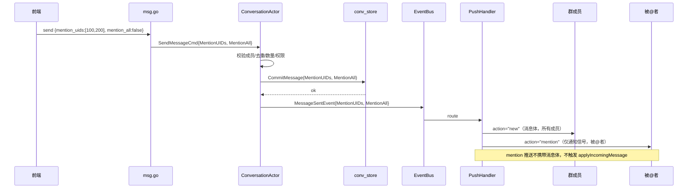

需求文档：[02-群聊@消息](../../requirements/02-群聊@消息.md)

# 群聊@消息 - 后端技术方案

## 一、需求分析

### 1.1 需求背景与目标

QIM 群聊缺少 @消息功能。需要打通端到端链路：前端发送 mention_uids → 后端校验/存储 → 推送时对被 @者强制通知（即使免打扰），前端展示高亮 + 会话列表 @我 标记。

### 1.2 现状分析

数据库 `Message` 表已有 `mention_uids` 字段（`gorm:"size:512"`），但整条链路未使用：

```
SendMessageCmd → ConversationActor → store.CommitMessage → MessageSentEvent → PushHandler → Gateway
                  ↑ 无 mention_uids      ↑ 未写入           ↑ 未携带         ↑ 无特殊处理
```

具体缺失：

| 环节 | 现状 | 缺失 |
|------|------|------|
| `SendMessageCmd` | 无 mention 字段 | 缺 `MentionUIDs` + `MentionAll` |
| `MessageAppendInput` | 无 mention 字段 | 缺 `MentionUIDs` + `MentionAll` |
| `MessageSentEvent` | 无 mention 字段 | 缺 `MentionUIDs` + `MentionAll` |
| `conv_store.CommitMessage` | 未写入 mention_uids | 需序列化写入 |
| `message/actor.go toDTO()` | 未读出 mention_uids | 需反序列化读出 |
| `PushHandler` | 所有消息统一推送 | 缺 mention 穿透免打扰推送 |
| `Message.MentionUIDs` | `size:512` | 500 人群 @全体展开后超限，需扩容 |
| `Message` 表 | 无 `MentionAll` 字段 | 需新增 |

### 1.3 核心问题与约束

1. **存储容量**：@全体成员展开后 JSON 远超 512 字节 → 不展开存储，新增 `MentionAll bool` 字段
2. **推送去重**：被 @者不能收到两次消息体 → `mention` 推送仅作通知信号，不携带消息体
3. **免打扰穿透**：当前前端 Notification 不检查 `is_muted` → 需先建出免打扰静默能力
4. **不新增 Actor/不新增域**：纯穿线改动

## 二、系统概要设计

### 2.1 架构设计

不新增 Actor，在现有 ConversationActor + PushHandler 链路上穿线：

```
                    ┌─────────────────────────────────────────────────┐
                    │              ConversationActor                  │
                    │  handleSendMessage:                             │
                    │    1. 校验 MentionUIDs（成员/去重/数量/权限）    │
                    │    2. 校验 MentionAll（管理员权限）               │
                    │    3. store.CommitMessage（写入 mention 字段）   │
                    │    4. publishMessageSent（携带 MentionUIDs）     │
                    └──────────┬──────────────────────────────────────┘
                               │ EventBus
                               ▼
                    ┌─────────────────────────────────────────────────┐
                    │              PushHandler                        │
                    │  routePushEvent:                                │
                    │    → action="new"：推给所有成员（消息体）        │
                    │    → action="mention"：推给被@者（仅通知信号）   │
                    │      如果 MentionAll=true，展开为全体成员        │
                    └─────────────────────────────────────────────────┘
```

### 2.2 时序图



### 2.3 数据流图

```
前端 WS ──SendMessageCmd{MentionUIDs, MentionAll}──► ConversationActor
                                                      │
                                        ┌─────────────┤
                                        │             │
                                        ▼             ▼
                              store.CommitMessage   EventBus.Publish
                              (MentionUIDs JSON     (MessageSentEvent{
                               + MentionAll bool)    MentionUIDs, MentionAll})
                                        │             │
                                        ▼             ▼
                                    DB Message      PushHandler
                                                      │
                                        ┌─────────────┤
                                        │             │
                                        ▼             ▼
                              action="new"      action="mention"
                              (所有成员)          (被@者，穿透免打扰)
                                        │             │
                                        ▼             ▼
                                    GatewayActor   GatewayActor
                                        │             │
                                        ▼             ▼
                                    前端消息列表    前端通知弹窗
```

### 2.4 推送策略

| 消息类型 | action | 推送对象 | 携带消息体 | 免打扰 | 走什么路径 |
|---------|--------|---------|-----------|--------|-----------|
| 普通消息 | `new` | 所有成员 | ✅ | 静默（前端不弹通知） | EventBus → PushHandler |
| @消息（消息体） | `new` | 所有成员 | ✅ | 静默 | EventBus → PushHandler |
| @消息（通知信号） | `mention` | 被 @者 | ❌ 仅 `{conversation_id, message_id}` | **穿透**（始终弹通知） | EventBus → PushHandler |

## 三、系统详细设计

### 3.1 WS 协议

#### 上行：发送消息

```json
{
  "type": "message",
  "action": "send",
  "data": {
    "conversation_id": 1,
    "msg_type": 1,
    "content": "@张三 你好",
    "reply_to": 0,
    "client_id": "xxx",
    "mention_uids": [100, 200],
    "mention_all": false
  }
}
```

| 字段 | 类型 | 必填 | 说明 |
|------|------|------|------|
| `mention_uids` | `number[]` | 否 | 被 @的成员 UID 列表，最多 50 个 |
| `mention_all` | `bool` | 否 | 是否 @全体成员，仅群主/管理员可设为 true |

#### 下行：消息推送（所有成员）

```json
{
  "type": "message",
  "action": "new",
  "data": {
    "id": 123,
    "conversation_id": 1,
    "seq": 42,
    "sender_id": 50,
    "msg_type": 1,
    "content": "@张三 你好",
    "mention_uids": [100, 200],
    "mention_all": false,
    "reply_to": 0,
    "client_id": "xxx",
    "created_at": 1700000000
  }
}
```

#### 下行：@通知信号（仅被 @者）

```json
{
  "type": "message",
  "action": "mention",
  "data": {
    "conversation_id": 1,
    "message_id": 123
  }
}
```

### 3.2 数据模型

#### Message 表变更

```go
type Message struct {
    // ... 现有字段不变
    MentionUIDs string `gorm:"type:text"`        // JSON 数组，存具体被@的 UID（扩容：size:512 → type:text）
    MentionAll  bool   `gorm:"default:false"`    // 新增：是否@全体成员
}
```

#### 存储格式

```sql
-- 普通@消息
mention_uids = '[100, 200]', mention_all = false

-- @全体成员（不展开，仅标记）
mention_uids = '[]', mention_all = true

-- @部分人 + @全体
mention_uids = '[100, 200]', mention_all = true
```

**不展开存储 @全体**：`MentionAll=true` 时 `MentionUIDs` 仅存用户手动 @的具体 UID。好处：
- 避免 500 人群 @全体时 JSON 超出字段容量
- 成员变化后历史消息的 @全体语义不模糊

### 3.3 消息定义

#### SendMessageCmd

```go
type SendMessageCmd struct {
    SenderID    uint64
    MsgType     int8
    Content     string
    ReplyTo     uint64
    ClientID    string
    MentionUIDs []uint64  // 新增
    MentionAll  bool      // 新增
}
```

#### MessageAppendInput

```go
type MessageAppendInput struct {
    ConversationID uint64
    Seq            int64
    SenderID       uint64
    MsgType        int8
    Content        string
    ReplyTo        uint64
    ClientID       string
    CreatedAt      int64
    MentionUIDs    []uint64  // 新增（类型为 []uint64，序列化由 DAL 负责）
    MentionAll     bool      // 新增
}
```

#### MessageSentEvent

```go
type MessageSentEvent struct {
    MessageID      uint64
    ConversationID uint64
    Seq            int64
    SenderID       uint64
    MemberUIDs     []uint64
    MsgType        int8
    Content        string
    ReplyTo        uint64
    ClientID       string
    CreatedAt      int64
    MentionUIDs    []uint64  // 新增
    MentionAll     bool      // 新增
}
```

#### MessageDTO（两处）

```go
// conversation.MessageDTO（发送响应）
type MessageDTO struct {
    // ... 现有字段
    MentionUIDs []uint64 `json:"mention_uids"`  // 新增
    MentionAll  bool     `json:"mention_all"`   // 新增
}

// message.MessageDTO（历史/搜索）
type MessageDTO struct {
    // ... 现有字段
    MentionUIDs []uint64 `json:"mention_uids"`  // 新增
    MentionAll  bool     `json:"mention_all"`   // 新增
}
```

### 3.4 校验规则

`handleSendMessage` 中的校验，按顺序执行：

| 序号 | 规则 | 失败行为 |
|------|------|---------|
| 1 | `MentionUIDs` 中的 UID 必须是群成员 | 非成员的 UID 静默过滤 |
| 2 | `MentionUIDs` 去重 | 自动去重 |
| 3 | `MentionUIDs` 最多 50 个 | 返回 `conversation.mention_limit_exceeded` |
| 4 | 单聊中 `MentionUIDs` 必须为空，`MentionAll` 必须为 false | 静默忽略/重置 |
| 5 | `MentionAll=true` 时发送者必须是群主或管理员 | 返回 `conversation.mention_all_forbidden` |

### 3.5 错误码

| 错误码 | HTTP 状态 | 说明 |
|--------|----------|------|
| `conversation.mention_limit_exceeded` | 400 | @人数超过 50 |
| `conversation.mention_all_forbidden` | 403 | 非管理员 @全体成员 |

### 3.6 推送路由

PushHandler `routePushEvent` 新增逻辑：

```go
case conversation.MessageSentEvent:
    // 普通消息推送（所有成员）
    // 返回 action="new", recipients=e.MemberUIDs, data=e

    // @通知推送（被@者，穿透免打扰）
    if len(e.MentionUIDs) > 0 || e.MentionAll {
        go h.pushMention(e)
    }
```

`pushMention` 方法：

```go
func (h *MessagePushHandler) pushMention(e conversation.MessageSentEvent) {
    mentionUIDs := make([]uint64, len(e.MentionUIDs))
    copy(mentionUIDs, e.MentionUIDs)

    if e.MentionAll {
        allMemberUIDs := h.getMemberUIDs(e.ConversationID)
        mentionUIDs = append(mentionUIDs, allMemberUIDs...)
        mentionUIDs = uniqueUIDs(mentionUIDs)
    }

    for _, uid := range mentionUIDs {
        if uid == e.SenderID { continue }
        h.pushToUser(uid, "message", "mention", map[string]any{
            "conversation_id": e.ConversationID,
            "message_id":      e.MessageID,
        })
    }
}
```

### 3.7 DAL 序列化/反序列化

`conv_store.CommitMessage`：`MentionUIDs []uint64` → `json.Marshal` → 写入 `mention_uids` 字段

`conv_store.GetMessage` / `message/actor.go toDTO()`：`mention_uids` 字段 → `json.Unmarshal` → `[]uint64`

## 四、改动清单

| 文件 | 改动类型 | 说明 |
|------|---------|------|
| `dal/models.go` | 修改 | `MentionUIDs` 改为 `gorm:"type:text"`；新增 `MentionAll bool` |
| `domain/conversation/messages.go` | 修改 | `SendMessageCmd` 新增 `MentionUIDs` + `MentionAll`；`MessageDTO` 新增字段 |
| `domain/conversation/store/records.go` | 修改 | `MessageAppendInput` 新增 `MentionUIDs []uint64` + `MentionAll bool` |
| `domain/conversation/message_handler.go` | 修改 | `handleSendMessage` 校验 + 传递 mention 信息 |
| `domain/conversation/events.go` | 修改 | `MessageSentEvent` 新增 `MentionUIDs` + `MentionAll` |
| `domain/conversation/errors.go` | 修改 | 新增 `ErrMentionLimitExceeded` + `ErrMentionAllForbidden` |
| `domain/message/messages.go` | 修改 | `MessageDTO` 新增 `MentionUIDs` + `MentionAll` |
| `domain/message/actor.go` | 修改 | `toDTO()` 填充 `MentionUIDs` 和 `MentionAll` |
| `dal/conv_store.go` | 修改 | `CommitMessage` 序列化写入；`GetMessage` 反序列化读出 |
| `transport/ws/push_handler.go` | 修改 | 新增 `pushMention` 方法 + `getMemberUIDs` 辅助 |
| `transport/ws/msg.go` | 修改 | 解析上行 `mention_uids` + `mention_all` |
| `backend/docs/api.md` | 修改 | 同步 WS 协议变更 |

## 五、测试补充

| 测试文件 | 必补用例 |
|---------|---------|
| `domain/conversation/actor_test.go` | 成员校验、去重、数量超限（>50）、@全体权限（非管理员拒绝）、单聊忽略 mention |
| `transport/ws/push_handler_test.go` | mention 推送路由、MentionAll 展开为全体成员、排除发送者自己 |
| `dal/conv_store_test.go` | MentionUIDs 序列化/反序列化（空数组、正常数组、MentionAll 组合） |

## 六、不改动

- 不新增域、不新增 Actor
- 消息类型 `msg_type` 不变（@消息仍然是文本消息）
- `Message` 表只新增 `MentionAll` 字段 + `MentionUIDs` 扩容为 text
- 不修改 `ConversationManagerActor`
- 不修改 `GatewayActor` 的频率限制逻辑
