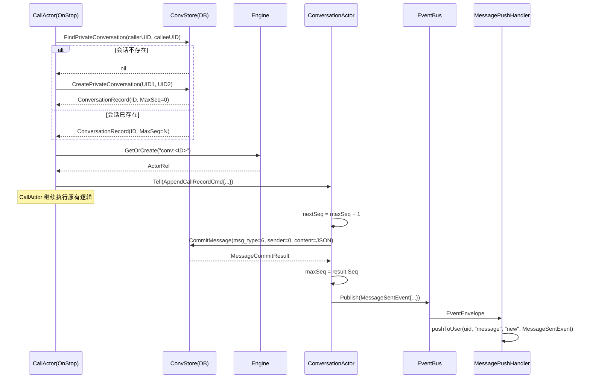

需求文档：[03-音视频通话二期-通话记录展示](../../requirements/03-音视频通话二期-通话记录展示.md)

# 音视频通话二期：通话记录展示 - 后端技术方案

## 一、需求分析

### 1.1 需求背景与目标

一期已实现 1对1 语音/视频通话的实时信令与控制，通话结束后已将通话记录持久化到 `Call` 表。本期将通话记录作为系统消息（`MsgType=6`）接入消息体系，使通话记录在聊天消息流中按时间序展示。

### 1.2 现状分析

| 环节 | 现状 | 可复用/缺失 |
|------|------|-------------|
| CallActor.OnStop | 写 Call 表 + 发布 CallEndedEvent/CallTimeoutEvent | **可扩展**：OnStop 已有 EventBus，可直接追加逻辑 |
| MsgType | `MsgTypeCallRecord = 6` 已定义在 `conversation/messages.go:9` | **可复用** |
| convStore.FindPrivateConversation | 根据两个 UID 查找私聊会话 | **可复用**，CallActor 需新增依赖 |
| convStore.CreatePrivateConversation | 事务创建会话 + 成员 + UserConversation | **可复用** |
| convStore.CommitMessage | 标准消息写入 + seq 管理 + 未读投射 | **可复用** |
| ConversationActor | 负责 seq 管理和消息写入 | 需新增 `AppendCallRecordCmd` 消息处理 |
| MessageSentEvent | 消息推送链路完整（EventBus → MessagePushHandler → GatewayActor） | **可复用**，无需改动 |
| PresenceActor | `GetGatewaysQuery` 获取用户 Gateway 引用 | **可复用** |

### 1.3 核心问题与约束

1. **Seq 一致性**：通话记录消息必须通过 ConversationActor 写入（非绕过 Actor 直写 DB），否则 maxSeq 与 Actor 内存状态不一致会导致后续消息 seq 冲突
2. **会话可能不存在**：两用户可能未建立私聊但已通话（如通过好友列表发起），需动态创建私聊会话
3. **OnStop 时机**：消息写入发生在 CallActor.OnStop 中，此时 CallActor 即将销毁，采用 Tell（fire-and-forget）+ 新消息类型方式，不阻塞 CallActor 生命周期

## 二、系统概要设计

### 2.1 架构设计

```
CallActor.OnStop
  ├── 1. 写 Call 表（一期已有，不变）
  ├── 2. 查找/创建私聊会话（convStore）
  ├── 3. 确保 ConversationActor 存在（engine.GetOrCreate）
  ├── 4. Tell → ConversationActor.AppendCallRecordCmd
  │         ├── 计算 nextSeq = maxSeq + 1
  │         ├── store.CommitMessage(msg_type=6, sender_id=0, content=JSON)
  │         ├── 更新 maxSeq
  │         └── EventBus.Publish(MessageSentEvent)
  └── 5. 发布 CallEndedEvent/CallTimeoutEvent（一期已有）
```

### 2.2 时序图



### 2.3 数据流图

```
CallActor.OnStop
  │
  ├─► Call 表 (一期)
  │
  └─► 查找/创建私聊 → conv:"<id>" Actor
         │
         └─► Tell AppendCallRecordCmd
               │
               ├─► CommitMessage(conversation_id, seq, sender=0, msg_type=6, content=JSON)
               │      ├─► INSERT INTO messages
               │      ├─► UPDATE conversations.max_seq
               │      └─► UPSERT user_conversations (unread+1 for both)
               │
               └─► EventBus.Publish(MessageSentEvent)
                      │
                      └─► MessagePushHandler → pushToUser("message", "new")
```

### 2.4 推送策略

通话记录消息完全复用现有 `message/new` 推送链路，无需新增推送事件：

| 消息类型 | 推送方式 | 推送对象 | action | 说明 |
|---------|---------|---------|--------|------|
| 通话记录系统消息 | EventBus → PushHandler | 双方所有设备 | `message/new` | 复用 MessageSentEvent |

## 三、系统详细设计

### 3.1 消息定义

新增 `AppendCallRecordCmd` 到 `conversation/messages.go`：

```go
// AppendCallRecordCmd 由 CallActor.OnStop 发送给 ConversationActor
type AppendCallRecordCmd struct {
    CallerUID uint64
    CalleeUID uint64
    CallType  int8
    Duration  int64
    EndReason string
    Status    int8  // 1=missed, 2=completed
}
```

### 3.2 数据模型

**Message.content JSON 格式**（msg_type=6 时）：

```json
{"call_id":"call_1700000000_a3f8c2b1","call_type":1,"duration":120,"end_reason":"hangup","status":2}
```

| 字段 | 类型 | 说明 |
|------|------|------|
| `call_id` | string | 通话唯一标识 |
| `call_type` | 1\|2 | 1=语音通话，2=视频通话 |
| `duration` | int64 | 通话时长（秒），未接通时为 0 |
| `end_reason` | string | hangup/rejected/timeout/cancelled/disconnect |
| `status` | 1\|2 | 1=未接通（missed），2=已接通（completed） |

`sender_id` 固定为 `0`（系统消息，双方均增加未读数）。

### 3.3 WS 协议

无需新增上行消息。

下行推送（复用 `message/new`）：

```json
{"type":"message","action":"new","data":{
    "message_id": 123,
    "conversation_id": 1,
    "seq": 10,
    "sender_id": 0,
    "msg_type": 6,
    "content": "{\"call_id\":\"call_xxx\",\"call_type\":1,\"duration\":120,\"end_reason\":\"hangup\",\"status\":2}",
    "reply_to": 0,
    "client_id": "",
    "created_at": 1700000000,
    "mention_uids": null,
    "mention_all": false
}}
```

### 3.4 校验规则

| 规则 | 处理 |
|------|------|
| ConversationActor 状态为已解散 | 跳过写入，仅记录日志 |
| sender_id 固定为 0 | 不校验成员身份 |

### 3.5 错误码

无新增错误码。AppendCallRecordCmd 是 Tell（fire-and-forget），写入失败仅记录日志。

## 四、改动清单

| 文件 | 改动类型 | 说明 |
|------|---------|------|
| `domain/conversation/messages.go` | 修改 | 新增 `AppendCallRecordCmd` 消息类型 |
| `domain/conversation/message_handler.go` | 修改 | 新增 `handleAppendCallRecord` 方法 |
| `domain/conversation/actor.go` | 修改 | Receive 新增 `AppendCallRecordCmd` 路由 |
| `domain/call/actor.go` | 修改 | OnStop 中新增通话记录消息写入逻辑；struct 新增 `convStore` 字段 |
| `cmd/server/app.go` | 修改 | `NewCallManagerActor` 传入 convStore |

## 五、测试补充

| 测试文件 | 必补用例 |
|---------|---------|
| `domain/call/actor_test.go` | OnStop 后消息写入：已接通/未接通场景；会话不存在时自动创建；ConvActor 收到 AppendCallRecordCmd；Conversation 不存在 len(members)==0 跳过 |
| `domain/conversation/actor_test.go` | AppendCallRecordCmd seq 递增、msg_type=6、content 为 JSON；sender=0 双方均 unread+1；ended conv 跳过写入 |

## 六、不改动

- 不修改 MessagePushHandler（复用现有 `message/new` 推送链路）
- 不修改 EventBus 订阅列表
- 不新增 HTTP API（全部走 WS 推送）
- 通话记录不可撤回/回复/转发——后端不限制，前端不渲染操作按钮
- 通话记录不参与关键词搜索（搜索基于 msg_type=1 text 类型，type=6 自然排除）
- 群聊通话记录（三期）
