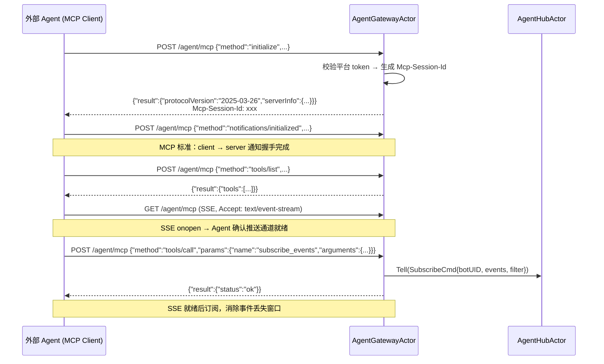
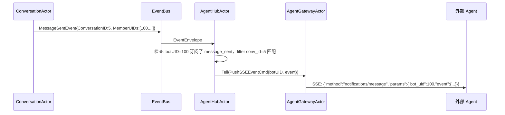
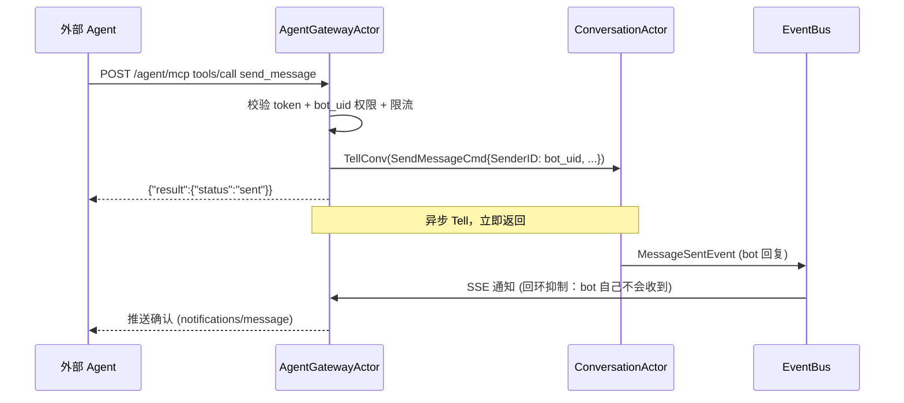
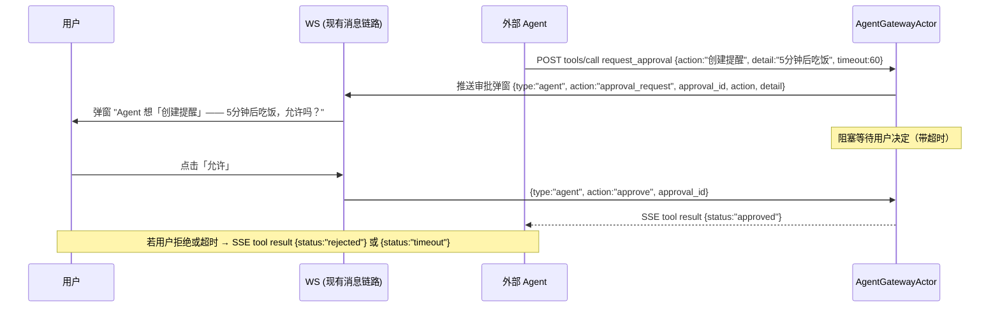

需求文档：[04-Agent Bot](../../requirements/04-Agent%20Bot.md)

# Agent Bot - 后端技术方案

## 一、需求分析

### 1.1 需求背景与目标

提供统一的 Agent 接入层，外部 Agent 进程通过 MCP 协议（JSON-RPC over HTTP）接入 QIM，以 Bot 身份服务所有用户。MCP 协议同时承载工具调用（Agent → QIM）和事件通知（QIM → Agent）。

### 1.2 现状分析

**可复用部分：**

| 模块 | 可复用内容 |
|------|-----------|
| Actor 框架 | Engine、ActorRef、Ask/Tell、Watch/Terminated、ScheduleAfter |
| EventBus | 现有事件类型（MessageSentEvent 等），Actor 订阅模式 |
| Conversation 域 | SendMessageCmd 发消息、ConvRef/AskConv 查询会话数据 |
| Message 域 | MsgStore/ReaderRef 读取消息历史 |
| Friend 域 | ListFriendsCmd 查询好友 |
| User 域 | UserStore 查询用户信息 |
| JWT 基础设施 | `internal/pkg/jwt` 签发/校验 token |
| Gin 路由 | 现有路由注册模式 |

**缺失部分：**

| 模块 | 缺失内容 |
|------|---------|
| Agent 接入层 | 全新 `transport/agent/` 模块，MCP 协议接入 |
| AgentHubActor | 事件订阅路由、Agent 侧订阅管理、事件过滤分发 |
| AgentGatewayActor | MCP 连接管理（SSE 流 + JSON-RPC 响应）、心跳、24h 断连清理 |
| UserType + CreatorUID | User 表缺 Bot 类型标识和归属关系 |
| BotConfig 表 | Bot 权限配置存储 |
| 平台 Token | 平台级 API Key，区别于用户 JWT |

### 1.3 核心问题与约束

1. **协议选型**：MCP 2025-03-26（Streamable HTTP），底层复用 SSE + POST，Agent 接入方用标准 MCP Client 即可
2. **Agent 数量**：一个 Agent 进程服务所有用户，一条连接，`bot_uid` 路由
3. **订阅与连接解耦**：订阅存在 AgentHubActor 中，连接断后订阅不丢，重连自动恢复
4. **权限校验**：不依赖 JWT 内嵌权限，服务端按 `bot_uid` 实时查询

---

## 二、系统概要设计

### 2.1 架构设计

```
                   ┌────────── QIM Transport ────────────┐
                   │                                      │
 Agent 进程        │  MCP (JSON-RPC over HTTP)            │
    (MCP Client)   │          │                           │
     │             │  ┌───────┴────────┐                  │
     │             │  │ AgentDispatcher│ (对标 ws Dispatcher)
     ├─ tools/call─┼─► POST /agent/mcp │                  │
     │   (主动调用) │  │                │                  │
     │             │  │  ├ ToolRouter  │ → Ask/Tell Actor│
     │             │  │  └ SubscribeRouter               │
     │             │  └────────────────┘                  │
     │             │          │                           │
     │             │    AgentGatewayActor (对标 ws GatewayActor)
     │             │      (agent-gw)                      │
     ├─ notify ◄───┼─ GET /agent/mcp (SSE stream)        │
     │   (被动接收)│      ├ SSE 通知推送                  │
     │             │      ├ 心跳 30s                      │
     │             │      └ 24h 断连清理                  │
     │             │           ▲                          │
     │             │           │ Tell                     │
     │             │    AgentHubActor（单例，对标 ws PushHandler）
     │             │      ├ 订阅注册表                    │
     │             │      ├ 按 bot_uid + filter 路由事件  │
     │             │      └ 订阅 EventBus                 │
     │             │           ▲                          │
     │             │           │ EventBus                 │
     │             │  ┌────────┴─────────┐                │
     │             │  │                  │                │
     │             │  ConversationActor  ...               │
     │             │  (MessageSentEvent)                  │
     └─────────────┴──────────────────────────────────────┘
```

**AgentHubActor（单例，名称：`agent-hub`）** — 对标 ws `PushHandler`
- 服务启动时 spawn
- 订阅 EventBus，管理 `botUID → subscribed events → eventName + filter` 映射
- 收到事件后按订阅表过滤，匹配的转发给 AgentGatewayActor

**AgentGatewayActor（名称：`agent-gw`）** — 对标 ws `GatewayActor`
- Agent 连接 MCP 时创建（复用，始终只有一个）
- 持有 MCP session：JSON-RPC handler + SSE writer
- 断连后启动 24h 定时器，超时清理自身

**AgentDispatcher** — 对标 ws `Dispatcher`
- 入口：`func Dispatch(method string, params json.RawMessage) (result JSON-RPC, err error)`
- 聚合 `ToolRouter` + `SubscribeRouter`，按 MCP method 分发

### 2.2 时序图

#### MCP 握手与工具发现



#### 事件通知



#### 工具调用（发消息）



#### 工具审批



### 2.3 数据流图

```
用户操作 → ConversationActor → EventBus
                                      │
                           ┌──────────┴──────────┐
                           │                     │
                     PushHandler           AgentHubActor
                    (人类用户推送)            (订阅 EventBus)
                                                 │
                              遍历订阅注册表 (botUID → events)
                                                 │
                              ┌──────────────────┤
                              │ 检查 eventType   │
                              │ 匹配 filter      │
                              └──────┬───────────┘
                                     │
                               AgentGatewayActor
                                     │
                              MCP SSE 通知推送
                                     │
                                外部 Agent
                                     │
                    内部路由到 user_sessions[botUID]
                                     │
                            LLM 处理 → 决策
                                     │
                          POST /agent/mcp tools/call
                          (send_message / get_messages / ...)
                                     │
                               ConversationActor
                               (正常消息链路)
```

### 2.4 推送策略

| 路径 | 角色 | 说明 |
|------|------|------|
| EventBus → AgentHubActor | 事件中枢 | AgentHubActor 订阅 Agent 关注的事件类型，按订阅表过滤分发 |
| AgentHubActor → AgentGatewayActor | 事件路由 | 匹配订阅的事件通过 Actor Tell 转发 |
| AgentGatewayActor → SSE | 对外通知 | 以 MCP notification 格式写入 SSE 流 |
| Agent → MCP tools/call → Actor | 主动操作 | JSON-RPC → AgentDispatcher → ToolRouter → resolveRef → Actor Ask/Tell |

---

## 三、系统详细设计

### 3.1 MCP 协议设计

#### 3.1.1 传输

MCP Streamable HTTP 模式（2025-03-26），单一端点：

| 端点 | 方法 | 用途 |
|------|------|------|
| `/agent/mcp` | POST | JSON-RPC 请求（initialize、tools/list、tools/call） |
| `/agent/mcp` | GET | SSE 流（server → client 通知） |

所有 POST 请求及 GET SSE 均需携带 `Mcp-Session-Id` header（初始化阶段由服务端下发）。

#### 3.1.2 鉴权与会话

所有请求带 `Authorization: Bearer <platform_token>`。

初始化阶段服务端生成 `Mcp-Session-Id`（UUID），通过 `initialize` 响应的 HTTP header 返回。后续所有 POST 和 GET SSE 请求均需在 header 中携带该 Session ID。服务端以此关联 SSE 连接与 JSON-RPC 请求到同一会话。

能力声明（`initialize` 响应）：

```json
{
  "result": {
    "protocolVersion": "2025-03-26",
    "capabilities": {
      "tools": { "listChanged": true }
    },
    "serverInfo": { "name": "QIM-Agent", "version": "1.0.0" }
  }
}
```

#### 3.1.3 Tools

```
tools/list 返回如下工具：
```

| 工具 | 说明 | 权限要求 |
|------|------|---------|
| `send_message` | 以 bot 身份发消息（异步，结果通过 SSE 通知） | — |
| `get_conversations` | 获取 bot 所在会话列表 | — |
| `get_messages` | 拉取会话消息 | — |
| `search_messages` | 搜索指定会话的消息 | `message:search` |
| `search_all_messages` | 跨会话全局搜索消息 | `message:search` |
| `get_friends` | 获取好友列表 | `friend:read` |
| `get_friend_conversations` | 获取好友的会话信息 | `friend:read` |
| `get_group_info` | 获取群聊基本信息 | `group:read` |
| `get_user` | 获取用户信息 | `friend:read` |
| `subscribe_events` | 订阅事件 | — |
| `unsubscribe_events` | 取消订阅 | — |
| `request_approval` | 向用户发起操作审批（召回：tool 调用阻塞至用户决定） | — |

详细定义：

**send_message**

```json
{
  "name": "send_message",
  "description": "以 bot 身份发送消息到指定会话。异步执行，结果通过 SSE 通知返回（notifications/message_sent 事件）。",
  "inputSchema": {
    "type": "object",
    "properties": {
      "bot_uid": {"type": "integer", "description": "bot 用户 ID"},
      "conversation_id": {"type": "integer", "description": "目标会话 ID"},
      "msg_type": {"type": "integer", "description": "消息类型", "default": 1},
      "content": {"type": "string", "description": "消息正文"},
      "reply_to": {"type": "integer", "description": "回复的消息 ID", "default": 0},
      "client_id": {"type": "string", "description": "去重 ID"}
    },
    "required": ["bot_uid", "conversation_id", "content"]
  }
}
```

**get_messages**

```json
{
  "name": "get_messages",
  "description": "拉取指定会话的历史消息",
  "inputSchema": {
    "type": "object",
    "properties": {
      "bot_uid": {"type": "integer"},
      "conversation_id": {"type": "integer"},
      "before_seq": {"type": "integer", "description": "游标，从此 seq 向前拉取", "default": 0},
      "limit": {"type": "integer", "description": "条数", "default": 20}
    },
    "required": ["bot_uid", "conversation_id"]
  }
}
```

**search_messages**

```json
{
  "name": "search_messages",
  "description": "搜索会话消息（需 message:search 权限）",
  "inputSchema": {
    "type": "object",
    "properties": {
      "bot_uid": {"type": "integer"},
      "conversation_id": {"type": "integer"},
      "keyword": {"type": "string"},
      "limit": {"type": "integer", "default": 20}
    },
    "required": ["bot_uid", "conversation_id", "keyword"]
  }
}
```

**subscribe_events**

```json
{
  "name": "subscribe_events",
  "description": "订阅 QIM 内部事件，匹配后通过 SSE 推送",
  "inputSchema": {
    "type": "object",
    "properties": {
      "bot_uid": {"type": "integer"},
      "events": {
        "type": "array",
        "items": {"type": "string", "enum": ["message_sent", "message_revoked", "member_joined", "member_left", "conversation_updated"]}
      },
      "filter": {
        "type": "object",
        "properties": {
          "conv_id": {"type": "integer"}
        }
      }
    },
    "required": ["bot_uid", "events"]
  }
}
```

**unsubscribe_events**

```json
{
  "name": "unsubscribe_events",
  "description": "取消事件订阅",
  "inputSchema": {
    "type": "object",
    "properties": {
      "bot_uid": {"type": "integer"},
      "events": {"type": "array", "items": {"type": "string"}}
    },
    "required": ["bot_uid"]
  }
}
```

**request_approval**

```json
{
  "name": "request_approval",
  "description": "向用户发起操作审批。调用后阻塞，用户同意/拒绝后通过 SSE 返回 tool 结果。",
  "inputSchema": {
    "type": "object",
    "properties": {
      "bot_uid": {"type": "integer"},
      "conversation_id": {"type": "integer", "description": "向用户展示审批弹窗的会话 ID"},
      "action": {"type": "string", "description": "操作名称，如 '创建提醒'、'总结会话'"},
      "detail": {"type": "string", "description": "操作详情，如 '提醒内容：5分钟后吃饭'"},
      "timeout_seconds": {"type": "integer", "description": "超时秒数，超时自动拒绝", "default": 60}
    },
    "required": ["bot_uid", "conversation_id", "action", "detail"]
  }
}
```

#### 3.1.4 Notifications（SSE 推送）

GET `/agent/mcp` 建立 SSE 连接后，服务端以 MCP notification 格式推送事件：

```
event: message
data: {"jsonrpc":"2.0","method":"notifications/message","params":{"bot_uid":100,"type":"message_sent","conversation_id":5,"seq":42,"sender_id":50,"content":"你好"}}

event: message
data: {"jsonrpc":"2.0","method":"notifications/message","params":{"bot_uid":100,"type":"member_joined","conversation_id":8,"new_member_uid":60}}

: heartbeat
```

心跳为 30s 一条空注释。支持 `Last-Event-ID` 断点续推。

#### 3.1.5 审批 WS 协议

`request_approval` 调用时，向用户端推送审批请求（走现有消息链路）：

```json
// 下行：推送给用户
{"type":"agent","action":"approval_request","data":{
  "approval_id":"uuid",
  "bot_uid":100,
  "conversation_id":5,
  "action":"创建提醒",
  "detail":"提醒内容：5分钟后吃饭",
  "timeout_seconds":60
}}

// 上行：用户操作
{"type":"agent","action":"approve","data":{"approval_id":"uuid"}}
{"type":"agent","action":"reject","data":{"approval_id":"uuid"}}
```

agentGatewayActor 收到 approve/reject 后，将结果作为 `request_approval` tool 的返回值通过 SSE 返回给 Agent。超时未操作则返回 `{status: "timeout"}`。

#### 3.1.6 事件类型映射

| 通知 `type` 字段 | EventBus 事件 | 触发条件 |
|-----------------|--------------|---------|
| `message_sent` | `conversation.MessageSentEvent` | 会话新消息 |
| `message_revoked` | `conversation.MessageRevokedEvent` | 消息撤回 |
| `member_joined` | `conversation.MemberJoinedEvent` | 群成员加入 |
| `member_left` | `conversation.MemberLeftEvent` | 群成员离开 |
| `conversation_updated` | `conversation.ConversationUpdatedEvent` | 会话信息更新 |

#### 3.1.7 限流

| 规则 | 作用域 | 限制 |
|------|--------|------|
| `send_message` 频率 | 每个 `bot_uid` | 10 次/秒 |
| `tools/call` 总频率 | 整个 Agent 连接 | 100 次/秒 |

超限返回 JSON-RPC error `-32003 agent.rate_limited`。

#### 3.1.8 平台 Token 生命周期

**生成**（QIM 管理员操作）：

```
$ openssl rand -hex 32              # 生成 secret
$ PAYLOAD="uid:agent:$(date +%s):$(openssl rand -hex 4)"
$ TOKEN=$(echo -n "$PAYLOAD" | openssl dgst -hmac "$SECRET" -sha256 | base64)
```

**分发**：

| 接收方 | 环境变量 | 说明 |
|--------|---------|------|
| QIM 服务端 | `AGENT_PLATFORM_TOKEN` + `AGENT_PLATFORM_SECRET` | 校验 Agent 请求 |
| Agent 进程 | `QIM_PLATFORM_TOKEN` + `QIM_PLATFORM_SECRET` | 签后续请求 |

**校验**（QIM 服务端每次收到 POST / GET 时）：

```
1. 提取 Authorization: Bearer <token>
2. HMAC 校验 token 是否由 AGENT_PLATFORM_SECRET 签名
3. 校验通过 → 请求合法
4. 校验失败 → 401 agent.unauthorized
```

secret 变更时管理员重新生成 token+secret 并同步更新双方环境变量，重启生效。后续可扩展 token 内嵌过期时间（`iat` 校验 90 天过期）。

#### 3.1.9 推荐调用顺序

Agent 启动时应按以下顺序操作，确保事件不丢失：

```
1. POST initialize                              → 握手鉴权，获取 Mcp-Session-Id
2. POST notifications/initialized               → MCP 标准：通知服务端客户端就绪
   (后续所有请求均携带 Mcp-Session-Id header)
3. POST tools/list                              → 发现可用工具
4. GET  SSE 连接 (Mcp-Session-Id)               → 建立推送通道（等待 EventSource.onopen）
5. POST tools/call subscribe_events             → SSE 就绪后注册订阅，事件即时推送
```

`subscribe_events` 必须在 SSE `onopen` 之后调用。AgentGatewayActor 内部维护 SSE 连接状态，若 SSE 未就绪时收到 `subscribe_events`，订阅会存储但事件暂不推送，直到 SSE 连接建立后自动开始推送。

### 3.2 数据模型

#### User 表变更

```go
type User struct {
    // ... 现有字段不变
    UserType   int8   `gorm:"default:0"`       // 新增：0=normal, 1=bot
    CreatorUID uint64 `gorm:"default:0;index"` // 新增：bot 归属的真实用户 UID
}
```

#### BotConfig 表（新增）

```go
type BotConfig struct {
    ID          uint64 `gorm:"primaryKey;autoIncrement"`
    UID         uint64 `gorm:"uniqueIndex;not null"`          // bot 的 User ID
    Permissions string `gorm:"type:text;default:'[]'"`        // 权限 JSON 数组
    CreatedAt   int64  `gorm:"not null"`
    UpdatedAt   int64  `gorm:"not null"`
}
```

`Permissions`：`["friend:read","message:search","group:read"]`

#### Platform Token

通过环境变量 `AGENT_PLATFORM_TOKEN` + `AGENT_PLATFORM_SECRET` 注入。Token 为 HMAC 签名格式（详见 3.1.8），不存 DB。

### 3.3 消息定义

```go
package agent

type Result struct {    // 对标 conversation.Result / call.Result 等
    Data any
    Err  error
}

// ---- Actor 间消息 ----

type SubscribeCmd struct {
    BotUID uint64
    Events []string
    Filter *EventFilter
}

type UnsubscribeCmd struct {
    BotUID uint64
    Events []string  // 空 = 取消该 bot 全部订阅
}

type EventFilter struct {
    ConvID *uint64
}

type PushNotificationCmd struct {
    BotUID uint64
    Type   string
    Event  any
}

// RefreshPermissionsCmd 用户修改权限后通知 AgentHubActor 刷新缓存
type RefreshPermissionsCmd struct {
    BotUID uint64
}
```

### 3.4 校验规则

| 序号 | 规则 | 位置 | 错误码 |
|------|------|------|--------|
| 1 | 提取 `Authorization: Bearer <token>`，HMAC 校验 | Gin middleware（`/agent/mcp` 路由组） | `agent.unauthorized` |
| 2 | `bot_uid` 存在且 `UserType=bot` | ToolRouter / SubscribeRouter | `agent.bot_not_found` |
| 3 | 操作所需权限在 bot 的 permissions 中 | ToolRouter（内存缓存查询） | `agent.permission_denied` |
| 4 | subscribe events 值在白名单内 | SubscribeRouter | `agent.invalid_event` |

### 3.5 错误码

使用项目统一 `apperr` 模式（对标 http `errors.go`）：

```go
var (
    ErrUnauthorized      = apperr.New("agent.unauthorized", "invalid platform token")
    ErrBotNotFound       = apperr.New("agent.bot_not_found", "bot user not found")
    ErrPermissionDenied  = apperr.New("agent.permission_denied", "bot lacks required permission")
    ErrInvalidEvent      = apperr.New("agent.invalid_event", "event type not in whitelist")
    ErrRateLimited       = apperr.New("agent.rate_limited", "too many requests")
)
```

JSON-RPC error 码映射：`apperr` code → MCP JSON-RPC error code：

| apperr code | JSON-RPC code |
|------------|--------------|
| `agent.unauthorized` | -32001 |
| `agent.bot_not_found` | -32602 |
| `agent.permission_denied` | -32002 |
| `agent.invalid_event` | -32602 |
| `agent.rate_limited` | -32003 |

### 3.6 AgentHubActor 核心逻辑（对标 ws `PushHandler.Receive`）

```go
func (h *AgentHubActor) Receive(ctx actor.Context) {
    switch msg := ctx.Message().(type) {
    case eventbus.EventEnvelope:
        h.handleEvent(msg.Event)
    case SubscribeCmd:
        h.handleSubscribe(msg)
    case UnsubscribeCmd:
        h.handleUnsubscribe(msg)
    case RefreshPermissionsCmd:
        h.refreshPermissions(msg.BotUID)
    }
}

func (h *AgentHubActor) handleEvent(event eventbus.Event) {
    // 二级索引：O(1) 定位事件类型
    subs := h.subscriptions[event.Name()]
    if subs == nil { return }

    for botUID, botSubs := range subs {
        for _, sub := range botSubs {
            if sub.filter != nil && !sub.filter.Match(event) { continue }
            // 回环抑制：bot 自己发的消息不推回
            if eventMessagesSent, ok := event.(conversation.MessageSentEvent); ok {
                if eventMessagesSent.SenderID == botUID { continue }
            }
            h.gwRef.Tell(PushNotificationCmd{BotUID: botUID, Type: toAgentEventName(event), Event: event})
        }
    }
}
```

权限缓存：AgentHubActor 启动时从 BotStore 加载全部 BotConfig，缓存 `map[botUID][]permission`。用户修改权限时（HTTP handler → BotStore 写入 → `RefreshPermissionsCmd` → AgentHubActor 刷新缓存）。tools/call 权限校验走内存。

### 3.7 AgentGatewayActor 生命周期（对标 ws `GatewayActor`）

```go
func (g *AgentGatewayActor) Receive(ctx actor.Context) {
    switch msg := ctx.Message().(type) {
    case PushNotificationCmd:
        if g.sseWriter != nil {
            g.sseWriter.Write(msg)  // SSE 推送
        } else {
            g.pendingEvents = append(g.pendingEvents, msg)  // 积压
        }
    case SSEConnected:  // Gin handler 通知 SSE 已建立
        g.sseReady = true
        g.cancelTimeout()
        for _, evt := range g.pendingEvents {
            g.sseWriter.Write(evt)
        }
        g.pendingEvents = nil
    case SSEDisconnected:
        g.sseReady = false
        g.scheduleTimeout(24h, func() { ctx.Stop(ctx.Self()) })
    case agentSignal.StartShutdown:
        g.closeSSE()
        ctx.Stop(ctx.Self())
    }
}
```

### 3.8 AgentDispatcher 分发模式（对标 ws `Dispatcher`）

```go
type AgentDispatcher struct {
    tools      *ToolRouter
    subscribe  *SubscribeRouter
    gwRef      *actor.ActorRef  // AgentGatewayActor
}

// Dispatch 按 MCP method 分发，对标 ws Dispatcher.Dispatch
func (d *AgentDispatcher) Dispatch(method string, params json.RawMessage) (any, error) {
    switch method {
    case "initialize":
        return d.handleInitialize(params)
    case "tools/list":
        return d.listTools()
    case "tools/call":
        return d.handleToolCall(params)
    case "notifications/initialized":
        // MCP 标准：客户端握手完成通知
        return nil, nil
    default:
        return nil, apperr.New("agent.unknown_method", "unknown method: "+method)
    }
}

func (d *AgentDispatcher) handleToolCall(params json.RawMessage) (any, error) {
    // 解析 toolName + arguments
    // 对标 ws router 的 resolveAction 模式
    switch toolName {
    case "subscribe_events":
        return d.subscribe.resolve(params)
    case "unsubscribe_events":
        return d.subscribe.resolve(params)
    default:
        return d.tools.resolve(toolName, params)  // → resolveAction → resolveRef → fn(ref, cmd)
    }
}
```

### 3.9 ToolRouter 分发模式（对标 ws `convRouter` 等）

```go
type ToolRouter struct {
    convSvc    *service.ConvService
    msgSvc     *service.MsgService
    friendSvc  *service.FriendService
    botStore   *dal.BotStore
    hubRef     *actor.ActorRef   // AgentHubActor
    gwRef      *actor.ActorRef   // AgentGatewayActor
}

// 每个 tool 遵循 resolveParams → resolveRef → fn(ref, cmd) 模式
// 对标 ws convRouter.resolveAction → resolveRef → fn(ref, cmd, action)

func (r *ToolRouter) sendMessage(botUID uint64, p sendMessageParams) (any, error) {
    ref, err := r.convSvc.ConvRef(p.ConversationID)
    if err != nil {
        return nil, err
    }
    cmd := conversation.SendMessageCmd{
        SenderID: botUID,
        MsgType:  p.MsgType,
        Content:  p.Content,
        ReplyTo:  p.ReplyTo,
        ClientID: p.ClientID,
    }
    // 异步 Tell，对标 ws tellDispatch
    return nil, ref.Tell(cmd)
}

func (r *ToolRouter) getMessages(botUID uint64, p getMessagesParams) (any, error) {
    ref, err := r.msgSvc.ReaderRef(p.ConversationID)
    if err != nil {
        return nil, err
    }
    cmd := message.ListMessagesCmd{...}
    // 同步 Ask，对标 ws askDispatch
    raw, err := ref.Ask(cmd, askTimeout)
    if err != nil {
        return nil, err
    }
    return raw, nil
}
```

---

## 四、风险与优化措施

| # | 风险 | 严重度 | 缓解 |
|---|------|--------|------|
| R1 | Agent 先 subscribe 后建 SSE，中间窗口事件丢失 | 高 | **方案已修复**：推荐调用顺序固定为 initialize → initialized → tools/list → SSE → subscribe_events（3.1.9）。AgentGatewayActor 在 SSE 未就绪时暂存订阅不推送 |
| R2 | AgentHubActor 事件遍历 O(n·m)，高频事件堆积 | 中 | **方案已修复**：`map[eventName]map[botUID][]subscription` 二级索引，O(1) 定位事件类型 |
| R3 | 平台 Token 单点泄露，全平台 Bot 被接管 | 中 | **方案已修复**：Token 改为 HMAC 签名格式（3.1.8），后续可加 90 天过期 |
| R4 | Bot 消息回环（Bot 发消息 → EventBus → 又推回 Agent） | 中 | **方案已修复**：AgentHubActor 推事件前检查 `event.SenderID == botUID` → skip |
| R5 | `send_message` 同步 AskConv，慢路径导致 MCP 超时 | 中 | **方案已修复**：改为 TellConv 异步发送，立即返回 ack，结果通过 SSE 通知 |
| R6 | `search_messages` 绑 conversation_id，无法全局搜索 | 低 | **方案已修复**：新增 `search_all_messages` tool（3.1.3） |
| R7 | 权限校验每次查 DB，高频调用下 DB 压力大 | 低 | **方案已修复**：AgentHubActor 内存缓存权限（3.6），权限变更时刷新 |
| R8 | Agent bug 导致消息风暴 | 低 | **方案已修复**：send_message 每 bot_uid 10次/秒限流（3.1.7） |

| # | 可选优化 | 当期不做 | 理由 |
|---|---------|---------|------|
| O1 | SSE 断连期间的事件持久化重放 | 不做 | EventBus 不持久化，Agent 重连后主动 `get_messages` 补拉即可 |
| O2 | AgentGatewayActor 多实例负载分担 | 不做 | 单 Agent 单连接，SSE I/O 串行瓶颈不在此 |
| O3 | MCP resources 支持（文件/图片等） | 不做 | 一期仅 tools，二进制资源后续 |

---

## 五、改动清单

| 文件 | 改动 |
|------|------|
| `transport/agent/handler.go` | ★新增★ **AgentDispatcher**：聚合 MCP method 路由 + SSE 管理。`func Dispatch(method, params) → (result, error)` 按 method 分发给 ToolRouter / SubscribeRouter，**对标 ws `Dispatcher`** |
| `transport/agent/tools.go` | ★新增★ **ToolRouter**：10 个 tool 实现，每个 tool 解析 params → 构建 cmd → Ask/Tell Actor，**对标 ws 各 domain router 的 `resolveAction → fn(ref, cmd, action)` 模式** |
| `transport/agent/subscribe.go` | ★新增★ **SubscribeRouter**：subscribe/unsubscribe 路由，**对标 ws presence/friend router** |
| `transport/agent/gateway.go` | ★新增★ **AgentGatewayActor**：SSE 连接管理 + 心跳 + 24h 清理 + 限流，**对标 ws `GatewayActor`** |
| `transport/agent/hub.go` | ★新增★ **AgentHubActor**：EventBus 订阅 + 二级索引订阅表 + 事件路由 + 权限缓存，**对标 ws `PushHandler`** |
| `transport/agent/messages.go` | ★新增★ Agent 域消息定义（Cmd/Event/DTO），**对标 `protocol.go`** |
| `transport/agent/errors.go` | ★新增★ Agent 域错误码，统一调用 `apperr`，**对标 http `errors.go`** |
| `transport/agent/sse.go` | ★新增★ SSE writer 工具函数（事件格式化 + Last-Event-ID + 心跳），纯 IO |
| `dal/models.go` | 修改：User 加 `UserType` + `CreatorUID`；新增 BotConfig 表 |
| `dal/bot_store.go` | ★新增★ **BotStore**：BotConfig CRUD，**对标 `conv_store.go` / `user_store.go`** |
| `transport/http/bot_handler.go` | ★新增★ **BotHTTPHandler**：Bot 激活/权限相关 Gin handler，**对标 `user_handler.go` / `friend_handler.go`** |
| `cmd/server/app.go` | 修改：注册 `/agent/mcp`、注册 `/api/bot/*`、Spawn AgentHubActor、注入 AgentDispatcher，**对标 `server.go` 的 `setupRoutes`** |

---

## 六、测试补充

| 测试文件 | 必补用例 |
|---------|---------|
| `transport/agent/hub_test.go` | subscribe/unsubscribe；事件路由（匹配 filter / 不匹配 / 回环抑制）；权限缓存刷新 |
| `transport/agent/gateway_test.go` | MCP 连接/断连；心跳；24h 超时；重连复用；限流触发 |
| `transport/agent/handler_test.go` | initialize / tools/list / tools/call（正常 + 权限拒绝 + 限流）；鉴权（有效/无效 token） |
| `dal/bot_store_test.go` | BotConfig CRUD；权限序列化 |

---

## 七、不改动

- 不修改 ConversationActor、GatewayActor、PresenceActor
- 不修改现有 WS Dispatcher 和 WS 协议
- 不修改 PushHandler（Agent 事件由 AgentHubActor 独立路由）
- 不提供自定义 REST 端点（通过 MCP tools 覆盖）
- 不在 JWT 中嵌入权限
- AgentHubActor/AgentGatewayActor 属 transport 层，不归 domain

## 八、预估工时

| 模块 | 内容 | 工时 |
|------|------|------|
| AgentHubActor | 二级索引订阅表、权限缓存、事件路由、回环抑制 | 1.5 天 |
| AgentGatewayActor | SSE 连接管理、心跳、24h 清理、限流 | 1 天 |
| MCP handler + tools | JSON-RPC 协议、10 个 tool 实现、鉴权 | 1.5 天 |
| DAL | User 表变更、BotConfig 表 + BotStore CRUD | 1 天 |
| HTTP handler | Bot 激活/权限授予/配置读取 | 1 天 |
| 集成 | app.go 路由注册、Spawn Actor、环境变量 | 0.5 天 |
| 测试 | hub/gateway/mcp/store 单测 | 1.5 天 |
| **合计** | | **8 天** |
