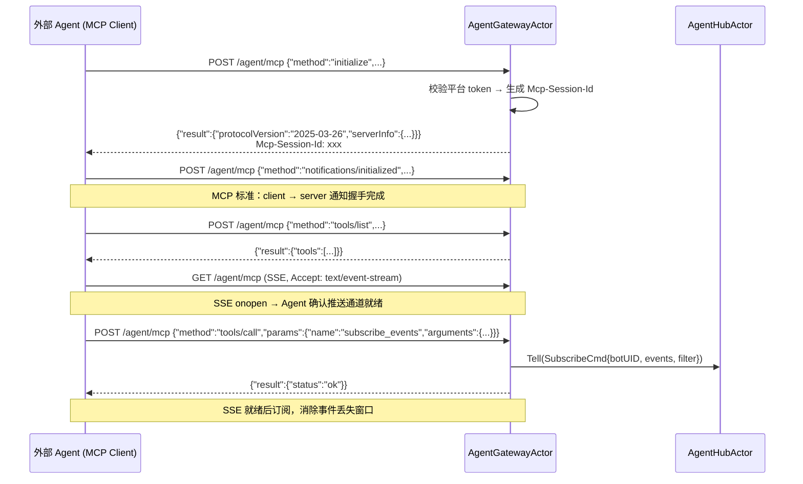
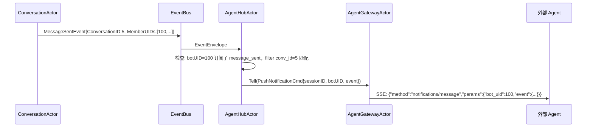
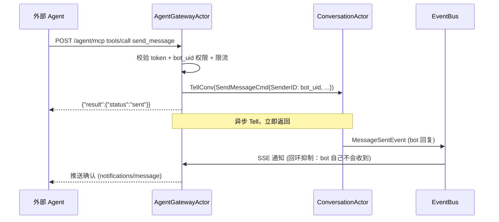
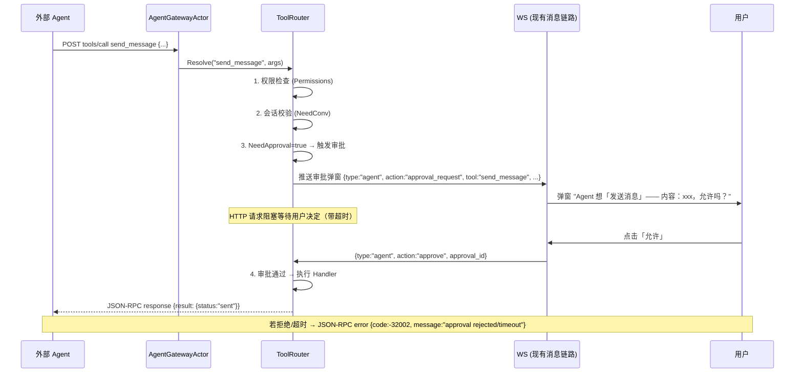

需求文档：[04-Agent Bot](../../requirements/04-Agent%20Bot.md)

# Agent Bot - 后端技术方案

## 一、需求分析

### 1.1 需求背景与目标

提供统一的 Agent 接入层，外部 Agent 进程通过 MCP 协议（JSON-RPC over HTTP）接入 QIM，以 Bot 身份服务所有用户。MCP 协议同时承载工具调用（Agent → QIM）和事件通知（QIM → Agent）。

### 1.2 现状分析

**可复用部分：**

| 模块 | 可复用内容 |
|------|-----------|
| Actor 框架 | Engine、ActorRef、Ask/Tell、Watch/Terminated、ScheduleAfter |
| EventBus | 现有事件类型（MessageSentEvent 等），Actor 订阅模式 |
| Conversation 域 | SendMessageCmd 发消息、ConvRef/AskConv 查询会话数据 |
| Message 域 | MsgStore/ReaderRef 读取消息历史 |
| Friend 域 | ListFriendsCmd 查询好友 |
| User 域 | UserStore 查询用户信息 |
| JWT 基础设施 | `internal/pkg/jwt` 签发/校验 token |
| Gin 路由 | 现有路由注册模式 |

**缺失部分：**

| 模块 | 缺失内容 |
|------|---------|
| Agent 接入层 | 全新 `transport/agent/` 模块，MCP 协议接入 |
| AgentHubActor | 事件订阅路由、Agent 侧订阅管理、事件过滤分发 |
| AgentGatewayActor | MCP 连接管理（SSE 流 + JSON-RPC 响应）、心跳、24h 断连清理 |
| UserType + CreatorUID | User 表缺 Bot 类型标识和归属关系 |
| BotConfig 表 | Bot 权限配置存储 |
| 平台 Token | 平台级 API Key，区别于用户 JWT |

### 1.3 核心问题与约束

1. **协议选型**：MCP 2025-03-26（Streamable HTTP），底层复用 SSE + POST，Agent 接入方用标准 MCP Client 即可
2. **Agent 数量**：一个或多个 Agent session 可同时活跃，按 `session_id -> connection/state` 隔离，业务侧继续通过 `bot_uid` 路由
3. **订阅与连接解耦**：订阅存在 AgentHubActor 中，连接断后订阅不丢，重连自动恢复
4. **权限校验**：不依赖 JWT 内嵌权限，服务端按 `bot_uid` 实时查询

---

## 二、系统概要设计

### 2.1 架构设计

```
                   ┌────────── QIM Transport ────────────┐
                   │                                      │
 Agent 进程        │  MCP (JSON-RPC over HTTP)            │
    (MCP Client)   │          │                           │
     │             │  ┌───────┴────────┐                  │
     │             │  │ AgentDispatcher│ (对标 ws Dispatcher)
     ├─ tools/call─┼─► POST /agent/mcp │                  │
     │   (主动调用) │  │                │                  │
     │             │  │  ├ ToolRouter  │ → Ask/Tell Actor│
     │             │  │  └ SubscribeRouter               │
     │             │  └────────────────┘                  │
     │             │          │                           │
     │             │    AgentGatewayActor (对标 ws GatewayActor)
     │             │      (agent-gw)                      │
     ├─ notify ◄───┼─ GET /agent/mcp (SSE stream)        │
     │   (被动接收)│      ├ SSE 通知推送                  │
     │             │      ├ 心跳 30s                      │
     │             │      └ 24h 断连清理                  │
     │             │           ▲                          │
     │             │           │ Tell                     │
     │             │    AgentHubActor（单例，对标 ws PushHandler）
     │             │      ├ 订阅注册表                    │
     │             │      ├ 按 bot_uid + filter 路由事件  │
     │             │      └ 订阅 EventBus                 │
     │             │           ▲                          │
     │             │           │ EventBus                 │
     │             │  ┌────────┴─────────┐                │
     │             │  │                  │                │
     │             │  ConversationActor  ...               │
     │             │  (MessageSentEvent)                  │
     └─────────────┴──────────────────────────────────────┘
```

**AgentHubActor（单例，名称：`agent-hub`）** — 对标 ws `PushHandler`
- 服务启动时 spawn
- 订阅 EventBus，管理 `eventName -> sessionID -> botUID -> subscriptions` 映射
- 收到事件后按 session / bot / filter 过滤，匹配的通过 `Tell(PushNotificationCmd)` 转发给 AgentGatewayActor
- 维护 Bot 权限缓存，ToolRouter 通过 `Ask(PermissionQuery)` 查询，权限修改后通过 `RefreshPermissionsCmd` 刷新

**AgentGatewayActor（名称：`agent-gw`）** — 对标 ws `GatewayActor`
- 服务启动时创建一个 `agent-gw` Actor 实例，内部维护多个 MCP session 状态
- 持有 `map[sessionID]*gatewaySessionState`：SSE writer、flusher、pending events、限流窗口、断连 timer
- 所有状态变更只通过 Actor mailbox 处理，不暴露外部直接调用状态方法
- 单个 session 断连后启动 24h 定时器，超时清理该 session 状态

**AgentDispatcher** — 对标 ws `Dispatcher`
- 入口：`func Dispatch(method string, params json.RawMessage) (result JSON-RPC, err error)`
- 聚合 `ToolRouter` + `SubscribeRouter`，按 MCP method 分发

### 2.2 时序图

#### MCP 握手与工具发现



#### 事件通知



#### 工具调用（发消息）



#### 工具审批（服务端强制阶段）

审批不是独立 tool，而是 ToolRouter 执行管线中的强制阶段。Agent 无法绕过。



**执行管线**：
```
Resolve(tool_call)
  → 1. 权限检查 (spec.Permissions)
  → 2. 会话成员校验 (spec.NeedConv)
  → 3. 人类审批 (spec.NeedApproval) ← 服务端强制，Agent 无法绕过
  → 4. 执行 Handler
```

哪些工具需要审批由 `ToolSpec.NeedApproval` 声明，服务端硬编码——写操作（send_message）需要审批，读操作不需要。

### 2.3 数据流图

```
用户操作 → ConversationActor → EventBus
                                      │
                           ┌──────────┴──────────┐
                           │                     │
                     PushHandler           AgentHubActor
                    (人类用户推送)            (订阅 EventBus)
                                                 │
                              遍历订阅注册表 (botUID → events)
                                                 │
                              ┌──────────────────┤
                              │ 检查 eventType   │
                              │ 匹配 filter      │
                              └──────┬───────────┘
                                     │
                               AgentGatewayActor
                                     │
                              MCP SSE 通知推送
                                     │
                                外部 Agent
                                     │
                    内部路由到 user_sessions[botUID]
                                     │
                            LLM 处理 → 决策
                                     │
                          POST /agent/mcp tools/call
                          (send_message / get_messages / ...)
                                     │
                               ConversationActor
                               (正常消息链路)
```

### 2.4 推送策略

| 路径 | 角色 | 说明 |
|------|------|------|
| EventBus → AgentHubActor | 事件中枢 | AgentHubActor 订阅 Agent 关注的事件类型，按订阅表过滤分发 |
| AgentHubActor → AgentGatewayActor | 事件路由 | 匹配订阅的事件通过 Actor Tell 转发 |
| AgentGatewayActor → SSE | 对外通知 | 以 MCP notification 格式写入 SSE 流 |
| Agent → MCP tools/call → Actor | 主动操作 | JSON-RPC → AgentDispatcher → ToolRouter → resolveRef → Actor Ask/Tell |

---

## 三、系统详细设计

### 3.1 MCP 协议设计

#### 3.1.1 传输

MCP Streamable HTTP 模式（2025-03-26），单一端点：

| 端点 | 方法 | 用途 |
|------|------|------|
| `/agent/mcp` | POST | JSON-RPC 请求（initialize、notifications/initialized、tools/list、tools/call） |
| `/agent/mcp` | GET | SSE 流（server → client 通知） |

`initialize` 是唯一不要求 `Mcp-Session-Id` 的请求；服务端在 `initialize` 响应 header 中下发 `Mcp-Session-Id`。除 `initialize` 外，后续所有 POST 请求及 GET SSE 均需携带该 header。

#### 3.1.2 鉴权与会话

所有请求带 `Authorization: Bearer <platform_token>`。

服务端采用**多活跃 MCP session** 模型，按 `session_id -> connection/state` 管理：

1. `initialize` 阶段服务端生成 `Mcp-Session-Id`（UUID），通过响应 header 返回，并在 `AgentSession` 表中落库。
2. 每个 session 独立维护自己的 `bot_uid` 访问记录、SSE 连接状态、心跳时间、限流窗口和待投递事件缓存。
3. 后续 POST 和 GET SSE 必须携带存在且未过期的 `Mcp-Session-Id`，否则返回 `401 agent.unauthorized`。
4. 同一个外部 Agent 进程可以只保留一个 session，也可以重启后重新 `initialize` 拿到新 session；旧 session 是否保留由 TTL 决定，而不是被全局单例覆盖。
5. `AgentGatewayActor` 内部使用 `map[sessionID]*gatewaySessionState` 管理多路连接；SSE writer、pending events、最后活跃时间都按 session 隔离。
6. `AgentSession` 需要持久化，进程重启后可从 DB 恢复 session 元数据；SSE writer 本身不持久化，但 session 身份、订阅、审批状态需可恢复。
7. session 默认 TTL 24h；超时未活跃的 session 由后台清理任务或 Actor 定时清理。

能力声明（`initialize` 响应）：

```json
{
  "result": {
    "protocolVersion": "2025-03-26",
    "capabilities": {
      "tools": { "listChanged": true }
    },
    "serverInfo": { "name": "QIM-Agent", "version": "1.0.0" }
  }
}
```

#### 3.1.3 Tools

```
tools/list 返回如下工具：
```

| 工具 | 说明 | 权限要求 | 需要审批 |
|------|------|---------|---------|
| `send_message` | 以 bot 身份发消息（异步，结果通过 SSE 通知） | — | **是** |
| `get_conversations` | 获取 bot 所在会话列表 | `conversation:read` | 否 |
| `get_messages` | 拉取会话消息 | `message:search` | 否 |
| `search_messages` | 搜索指定会话的消息 | `message:search` | 否 |
| `search_all_messages` | 跨会话全局搜索消息 | `message:search` | 否 |
| `get_friends` | 获取好友列表 | `friend:read` | 否 |
| `get_friend_conversations` | 获取好友的会话信息 | `friend:read` | 否 |
| `get_group_info` | 获取群聊基本信息 | `group:read` | 否 |
| `get_user` | 获取用户信息 | `friend:read` | 否 |
| `subscribe_events` | 订阅事件 | — | 否 |
| `unsubscribe_events` | 取消订阅 | — | 否 |

> `request_approval` 不再作为 Agent 可调用的 tool。审批是 ToolRouter 在执行写操作时自动触发的强制阶段（见 2.2 工具审批时序图）。Agent 调用 `send_message` 时，服务端自动拦截、推送审批弹窗给 bot owner，阻塞等待用户决定后才执行 handler。

详细定义：

**send_message**

```json
{
  "name": "send_message",
  "description": "以 bot 身份发送消息到指定会话。异步执行，结果通过 SSE 通知返回（notifications/message_sent 事件）。",
  "inputSchema": {
    "type": "object",
    "properties": {
      "bot_uid": {"type": "integer", "description": "bot 用户 ID"},
      "conversation_id": {"type": "integer", "description": "目标会话 ID"},
      "msg_type": {"type": "integer", "description": "消息类型", "default": 1},
      "content": {"type": "string", "description": "消息正文"},
      "reply_to": {"type": "integer", "description": "回复的消息 ID", "default": 0},
      "client_id": {"type": "string", "description": "去重 ID"}
    },
    "required": ["bot_uid", "conversation_id", "content"]
  }
}
```

**get_messages**

```json
{
  "name": "get_messages",
  "description": "拉取指定会话的历史消息",
  "inputSchema": {
    "type": "object",
    "properties": {
      "bot_uid": {"type": "integer"},
      "conversation_id": {"type": "integer"},
      "before_seq": {"type": "integer", "description": "游标，从此 seq 向前拉取", "default": 0},
      "limit": {"type": "integer", "description": "条数", "default": 20}
    },
    "required": ["bot_uid", "conversation_id"]
  }
}
```

**search_messages**

```json
{
  "name": "search_messages",
  "description": "搜索会话消息（需 message:search 权限）",
  "inputSchema": {
    "type": "object",
    "properties": {
      "bot_uid": {"type": "integer"},
      "conversation_id": {"type": "integer"},
      "keyword": {"type": "string"},
      "limit": {"type": "integer", "default": 20}
    },
    "required": ["bot_uid", "conversation_id", "keyword"]
  }
}
```

**subscribe_events**

```json
{
  "name": "subscribe_events",
  "description": "订阅 QIM 内部事件，匹配后通过 SSE 推送",
  "inputSchema": {
    "type": "object",
    "properties": {
      "bot_uid": {"type": "integer"},
      "events": {
        "type": "array",
        "items": {"type": "string", "enum": ["message_sent", "message_revoked", "member_joined", "member_left", "conversation_updated"]}
      },
      "filter": {
        "type": "object",
        "properties": {
          "conv_id": {"type": "integer"}
        }
      }
    },
    "required": ["bot_uid", "events"]
  }
}
```

**unsubscribe_events**

```json
{
  "name": "unsubscribe_events",
  "description": "取消事件订阅",
  "inputSchema": {
    "type": "object",
    "properties": {
      "bot_uid": {"type": "integer"},
      "events": {"type": "array", "items": {"type": "string"}}
    },
    "required": ["bot_uid"]
  }
}
```

#### 3.1.4 Notifications（SSE 推送）

GET `/agent/mcp` 建立 SSE 连接后，服务端以 MCP notification 格式推送事件：

```
event: message
data: {"jsonrpc":"2.0","method":"notifications/message","params":{"bot_uid":100,"type":"message_sent","conversation_id":5,"seq":42,"sender_id":50,"content":"你好"}}

event: message
data: {"jsonrpc":"2.0","method":"notifications/message","params":{"bot_uid":100,"type":"member_joined","conversation_id":8,"new_member_uid":60}}

: heartbeat
```

心跳为 30s 一条空注释。

一期仍不做完整 EventBus durable replay，但需要做到**会话与订阅可恢复**：

1. SSE 断线后 session 不立即失效，恢复窗口内重新 GET `/agent/mcp` 即可复用原 session。
2. 断线期间匹配到的事件先进入该 session 的 `pending events` 内存缓存；如果进程重启导致内存缓存丢失，Agent 需主动调用 `get_messages` / `search_messages` 补拉。
3. 服务重启后，`AgentSession`、`AgentSubscription` 从 DB 恢复；SSE writer 由 Agent 重连后重新绑定。
4. SSE 长连接建立时要立即刷新一次 `LastSeenAt/ExpiresAt`；之后每个 30s 心跳周期都要继续刷新 session TTL，避免“只有 GET 长连、没有 POST 请求”的 Agent 被误判为过期。
5. `Last-Event-ID` 仍不作为一期承诺能力，事件补偿依赖主动查询。

#### 3.1.5 审批 WS 协议

当 Agent 调用标记了 `NeedApproval=true` 的 tool 时，ToolRouter **自动**向用户端推送审批请求（走现有消息链路）：

```json
// 下行：ToolRouter 自动推送给 bot owner
{"type":"agent","action":"approval_request","data":{
  "approval_id":"uuid",
  "bot_uid":100,
  "conversation_id":5,
  "tool":"send_message",
  "summary":"发送消息到群「xxx」：你好",
  "timeout_seconds":60
}}

// 上行：用户操作
{"type":"agent","action":"approve","data":{"approval_id":"uuid"}}
{"type":"agent","action":"reject","data":{"approval_id":"uuid"}}
```

审批结果决定 tool 是否执行：
- `approved` → ToolRouter 继续执行 handler，将 handler 结果作为 JSON-RPC response 返回
- `rejected` / `timeout` → ToolRouter 返回 JSON-RPC error `{code:-32002, message:"approval rejected"}` 或 `{code:-32002, message:"approval timeout"}`

Agent 无法跳过审批——`NeedApproval` 由 ToolSpec 声明，服务端强制执行。

审批状态要求**持久化可恢复**：

1. 创建审批时，在 `AgentApproval` 表落库：`approval_id`、`session_id`、`bot_uid`、`owner_uid`、`conversation_id`、`action`、`detail`、`status=pending`、`expired_at`。
2. 用户点击 approve/reject 时，先按 `approval_id` 查库并 CAS 更新状态，再唤醒内存中的等待协程。
3. 若服务重启发生在审批等待中，`ApprovalManager` 启动时需要扫描未过期的 `pending` 审批并重建内存索引；原 HTTP 请求已断开时，本次调用会失败，但用户操作不会丢，后续可通过补充查询接口或 Agent 重试感知结果。
4. 过期审批由定时任务标记为 `timeout`，防止永久悬挂。

#### 3.1.6 事件类型映射

| 通知 `type` 字段 | EventBus `event.Name()` | Event struct | 触发条件 |
|-----------------|-------------------------|--------------|---------|
| `message_sent` | `conversation.message_sent` | `conversation.MessageSentEvent` | 会话新消息 |
| `message_revoked` | `conversation.message_revoked` | `conversation.MessageRevokedEvent` | 消息撤回 |
| `member_joined` | `conversation.member_joined` | `conversation.MemberJoinedEvent` | 群成员加入 |
| `member_left` | `conversation.member_left` | `conversation.MemberLeftEvent` | 群成员离开 |
| `conversation_updated` | `conversation.updated` | `conversation.ConversationUpdatedEvent` | 会话信息更新 |

订阅参数使用外部短名称（如 `message_sent`），`SubscribeRouter` 入库前必须转换为内部 EventBus 名称（如 `conversation.message_sent`）。`AgentHubActor` 的二级索引统一使用内部 EventBus 名称；推送到 SSE 时再转换回外部短名称。

#### 3.1.7 限流

| 规则 | 作用域 | 限制 |
|------|--------|------|
| `send_message` 频率 | 每个 `bot_uid` | 10 次/秒 |
| `tools/call` 总频率 | 整个 Agent 连接 | 100 次/秒 |

超限返回 JSON-RPC error `-32003 agent.rate_limited`。

#### 3.1.8 平台 Token 生命周期

一期采用固定平台 token，避免引入未完整设计的签名协议：

| 接收方 | 环境变量 | 说明 |
|--------|---------|------|
| QIM 服务端 | `AGENT_PLATFORM_TOKEN` | 校验 Agent 请求 |
| Agent 进程 | `QIM_PLATFORM_TOKEN` | 访问 QIM `/agent/mcp` 时放入 `Authorization: Bearer <token>` |

校验规则：

```
1. 提取 Authorization: Bearer <token>
2. 与 AGENT_PLATFORM_TOKEN 做常量时间比较
3. 校验通过 → 请求合法
4. 校验失败 → 401 agent.unauthorized
```

`AGENT_PLATFORM_TOKEN` 为空时，服务端仍注册 `/agent/mcp` 路由，但所有请求都返回 `401 agent.unauthorized`，避免本地/测试环境误开放。HMAC、过期时间、滚动密钥作为后续安全增强，不纳入一期。

#### 3.1.9 推荐调用顺序

Agent 启动时应按以下顺序操作，确保事件不丢失：

```
1. POST initialize                              → 握手鉴权，获取 Mcp-Session-Id
2. POST notifications/initialized               → MCP 标准：通知服务端客户端就绪
   (后续所有请求均携带 Mcp-Session-Id header)
3. POST tools/list                              → 发现可用工具
4. GET  SSE 连接 (Mcp-Session-Id)               → 建立该 session 的推送通道（等待 EventSource.onopen）
5. POST tools/call subscribe_events             → 对该 session 注册订阅，事件即时推送
```

`subscribe_events` 必须在 SSE `onopen` 之后调用。AgentGatewayActor 内部按 session 维护 SSE 连接状态，若该 session 的 SSE 未就绪时收到 `subscribe_events`，订阅会先持久化并写入内存，事件暂不推送，直到该 session 连接建立后自动开始推送。

### 3.2 数据模型

#### User 表变更

```go
type User struct {
    // ... 现有字段不变
    UserType   int8   `gorm:"default:0"`       // 新增：0=normal, 1=bot
    CreatorUID uint64 `gorm:"default:0;index"` // 新增：bot 归属的真实用户 UID
}
```

约束：
- `UserType=1` 表示 Bot 用户，`CreatorUID` 必须为真实用户 UID。
- `UserType=0` 时 `CreatorUID=0`。
- 每个真实用户最多一个 Bot；SQLite partial unique index 可选，一期至少在 `BotHTTPHandler.Activate` 中通过事务内查询保证幂等。
- Bot 不能注册登录、不能作为普通用户被搜索添加好友，相关 HTTP handler 需要按 `UserType` 过滤或拒绝。

#### BotConfig 表（新增）

```go
type BotConfig struct {
    ID          uint64 `gorm:"primaryKey;autoIncrement"`
    UID         uint64 `gorm:"uniqueIndex;not null"`          // bot 的 User ID
    Permissions string `gorm:"type:text;default:'[]'"`        // 权限 JSON 数组
    CreatedAt   int64  `gorm:"not null"`
    UpdatedAt   int64  `gorm:"not null"`
}
```

`Permissions`：`["friend:read","conversation:read","message:search","group:read"]`

#### AgentSession 表（新增）

```go
type AgentSession struct {
    ID           uint64 `gorm:"primaryKey;autoIncrement"`
    SessionID    string `gorm:"uniqueIndex;size:64;not null"`
    PlatformName string `gorm:"size:64"`                  // 可选，便于排障
    Status       int8   `gorm:"default:0"`                // 0=active,1=expired,2=closed
    LastSeenAt   int64  `gorm:"index;not null"`
    ExpiresAt    int64  `gorm:"index;not null"`
    CreatedAt    int64  `gorm:"not null"`
    UpdatedAt    int64  `gorm:"not null"`
}
```

说明：
- session 与具体用户不强绑定；访问控制仍由 `bot_uid -> CreatorUID` 校验负责。
- `LastSeenAt` 在 POST/GET 请求和 SSE 心跳时更新，用于 TTL 清理。
- 对于纯长连场景，心跳续期是 session 保活的主路径，不能只依赖一次 GET 建链。
- 服务重启后从该表恢复 session 元数据，但不会恢复旧 SSE writer。

#### AgentSubscription 表（新增）

```go
type AgentSubscription struct {
    ID         uint64 `gorm:"primaryKey;autoIncrement"`
    SessionID  string `gorm:"index:idx_agent_sub_session_event;size:64;not null"`
    BotUID     uint64 `gorm:"index:idx_agent_sub_session_event;not null"`
    EventName  string `gorm:"index:idx_agent_sub_session_event;size:64;not null"` // 内部 EventBus 名称
    FilterJSON string `gorm:"type:text;default:''"`                                 // {"conv_id": 5}
    CreatedAt  int64  `gorm:"not null"`
    UpdatedAt  int64  `gorm:"not null"`
}
```

说明：
- `EventName` 存内部 EventBus 名称，例如 `conversation.message_sent`。
- 同一个 `session_id + bot_uid + event_name + filter` 需要去重，避免重复订阅导致重复推送。
- `AgentHubActor` 启动时要从该表加载订阅，构建二级索引。

#### AgentApproval 表（新增）

```go
type AgentApproval struct {
    ID             uint64 `gorm:"primaryKey;autoIncrement"`
    ApprovalID     string `gorm:"uniqueIndex;size:64;not null"`
    SessionID      string `gorm:"index;size:64;not null"`
    BotUID         uint64 `gorm:"index;not null"`
    OwnerUID       uint64 `gorm:"index;not null"`
    ConversationID uint64
    Action         string `gorm:"size:128;not null"`
    Detail         string `gorm:"type:text;not null"`
    Status         int8   `gorm:"default:0"` // 0=pending,1=approved,2=rejected,3=timeout
    ExpiresAt      int64  `gorm:"index;not null"`
    ResolvedAt     int64
    CreatedAt      int64  `gorm:"not null"`
    UpdatedAt      int64  `gorm:"not null"`
}
```

说明：
- `approval_id` 是用户 WS approve/reject 的唯一关联键。
- 审批结果先写库，再唤醒内存等待方，保证服务异常时状态仍可追溯。
- 若 HTTP 请求已经中断，审批结果仍保留在 DB 中，供后续恢复或人工排障。

#### Platform Token

通过环境变量 `AGENT_PLATFORM_TOKEN` 注入。Token 为固定高熵随机字符串（详见 3.1.8），不存 DB。

#### Bot 激活事务

`POST /api/bot/activate` 必须具备幂等性，并在一个事务边界内完成：

1. 根据 `creator_uid` 查询是否已有 `UserType=1` 的 Bot；如果已有，直接返回已有 bot 和默认会话。
2. 创建 Bot User：`UserType=1`、`CreatorUID=creator_uid`、默认昵称/头像。
3. 创建 BotConfig：默认 `permissions=[]`。
4. 建立创建者与 Bot 的好友关系，Bot 不需要用户手动接受。
5. 创建创建者与 Bot 的私聊会话。
6. 任一步失败则回滚，避免出现只有 Bot User 或只有 BotConfig 的半初始化状态。

如当前 Store 接口无法跨 User/Friend/Conversation Store 复用同一个 DB transaction，需要补充事务型 Store 方法，或在 DAL 层新增专用 `ActivateBotTx` 聚合写入。

#### 多 Session 对话（Bot Session）

会话类型新增 `ConvTypeBotSession = 3`，支持用户与 bot 创建多个独立对话 session（对标 ChatGPT 多会话）。

**创建新 session**：`POST /api/bot/session` 每次调用都创建新的 `ConvTypeBotSession` 会话（不做 upsert 去重）。

**上下文获取**：Agent 收到 `message_sent` 事件时，payload 中包含 `conv_type`：
- `conv_type=3` → bot session，Agent 调 `get_messages(conv_id)` 拉该 session 完整聊天记录作为 LLM 上下文
- `conv_type=1` → 普通私聊（激活时创建的默认会话）
- `conv_type=2` → 群聊

**设计约束**：
- 每个 bot session 只包含 owner + bot 两个成员
- session 之间上下文完全隔离，Agent 不应跨 session 共享记忆
- 默认私聊会话（激活时创建）保留不变，作为 fallback
- `get_conversations` 返回的 `UserConvDTO.Conv.Type` 可用于筛选 bot sessions

### 3.3 消息定义

```go
package agent

type Result struct {    // 对标 conversation.Result / call.Result 等
    Data any
    Err  error
}

// ---- Actor 间消息 ----

type SubscribeCmd struct {
    SessionID string
    BotUID uint64
    Events []string
    Filter *EventFilter
}

type UnsubscribeCmd struct {
    SessionID string
    BotUID uint64
    Events []string  // 空 = 取消该 bot 全部订阅
}

type EventFilter struct {
    ConvID *uint64
}

type PushNotificationCmd struct {
    SessionID string
    BotUID uint64
    Type   string
    Event  any
}

// RefreshPermissionsCmd 用户修改权限后通知 AgentHubActor 刷新缓存
type RefreshPermissionsCmd struct {
    BotUID uint64
}

// PermissionQuery 通过 AgentHubActor mailbox 查询权限缓存
type PermissionQuery struct {
    BotUID     uint64
    Permission string
}

type SetupSSECmd struct {
    SessionID string
    Writer    io.Writer
    Flusher   http.Flusher
}

type SSEConnected struct {
    SessionID string
}

type SSEHeartbeat struct {
    SessionID string
}

type SSEDisconnected struct {
    SessionID string
}

type SetSessionCmd struct {
    SessionID string
}

type RateLimitQuery struct {
    SessionID string
    BotUID   uint64
    ToolName string
}

type AgentIdleTimeout struct {
    SessionID string
}

type AgentRefResolved struct {
    GwRef *actor.ActorRef
}
```

### 3.4 校验规则

| 序号 | 规则 | 位置 | 错误码 |
|------|------|------|--------|
| 1 | 提取 `Authorization: Bearer <token>`，与 `AGENT_PLATFORM_TOKEN` 常量时间比较 | Gin middleware（`/agent/mcp` 路由组） | `agent.unauthorized` |
| 2 | 除 `initialize` 外校验 `Mcp-Session-Id` 等于当前活跃 session | AgentDispatcher / AgentGatewayActor | `agent.unauthorized` |
| 3 | `bot_uid` 存在且 `UserType=bot` | ToolRouter / SubscribeRouter | `agent.bot_not_found` |
| 4 | Bot 的 `CreatorUID` 与资源归属一致，且 Bot 是目标会话成员 | ToolRouter | `agent.permission_denied` |
| 5 | 操作所需权限在 bot 的 permissions 中 | ToolRouter（内存缓存查询） | `agent.permission_denied` |
| 6 | subscribe events 值在白名单内 | SubscribeRouter | `agent.invalid_event` |

#### 权限与资源校验矩阵

| 工具 | Bot 校验 | 权限校验 | 资源归属校验 |
|------|---------|---------|-------------|
| `send_message` | `bot_uid` 为 Bot 用户 | 无额外权限 | Bot 是 `conversation_id` 成员，且该会话属于 Bot 创建者可访问范围 |
| `get_conversations` | `bot_uid` 为 Bot 用户 | `conversation:read` | 只返回 Bot 自己所在会话 |
| `get_messages` | `bot_uid` 为 Bot 用户 | `message:search` | Bot 是 `conversation_id` 成员 |
| `search_messages` | `bot_uid` 为 Bot 用户 | `message:search` | Bot 是 `conversation_id` 成员 |
| `search_all_messages` | `bot_uid` 为 Bot 用户 | `message:search` | 仅遍历 Bot 自己所在会话 |
| `get_friends` | `bot_uid` 为 Bot 用户 | `friend:read` | 返回 Bot 创建者的好友列表，而不是 Bot 自身好友列表 |
| `get_friend_conversations` | `bot_uid` 为 Bot 用户 | `friend:read` + `conversation:read` | `friend_uid` 必须是创建者好友，只返回创建者与该好友的会话 |
| `get_group_info` | `bot_uid` 为 Bot 用户 | `group:read` | Bot/创建者必须是该群成员 |
| `get_user` | `bot_uid` 为 Bot 用户 | `friend:read` | 只能读取创建者自己、Bot 自己、创建者好友的用户信息 |
| `subscribe_events` | `bot_uid` 为 Bot 用户 | 无额外权限 | 如带 `conv_id` filter，Bot 必须是该会话成员 |
| `request_approval` | `bot_uid` 为 Bot 用户 | 无额外权限 | `conversation_id` 必须是创建者与 Bot 的私聊或创建者可访问会话 |

### 3.5 错误码

使用项目统一 `apperr` 模式（对标 http `errors.go`）：

```go
var (
    ErrUnauthorized      = apperr.New("agent.unauthorized", "invalid platform token")
    ErrBotNotFound       = apperr.New("agent.bot_not_found", "bot user not found")
    ErrPermissionDenied  = apperr.New("agent.permission_denied", "bot lacks required permission")
    ErrInvalidEvent      = apperr.New("agent.invalid_event", "event type not in whitelist")
    ErrRateLimited       = apperr.New("agent.rate_limited", "too many requests")
)
```

JSON-RPC error 码映射：`apperr` code → MCP JSON-RPC error code：

| apperr code | JSON-RPC code |
|------------|--------------|
| `agent.unauthorized` | -32001 |
| `agent.bot_not_found` | -32602 |
| `agent.permission_denied` | -32002 |
| `agent.invalid_event` | -32602 |
| `agent.rate_limited` | -32003 |

### 3.6 AgentHubActor 核心逻辑（对标 ws `PushHandler.Receive`）

```go
func (h *AgentHubActor) Receive(ctx actor.Context) {
    switch msg := ctx.Message().(type) {
    case eventbus.EventEnvelope:
        h.handleEvent(msg.Event)
    case SubscribeCmd:
        h.handleSubscribe(msg, ctx)
    case UnsubscribeCmd:
        h.handleUnsubscribe(msg)
    case RefreshPermissionsCmd:
        h.refreshPermissions(msg.BotUID, ctx)
    case AgentRefResolved:
        h.gwRef = msg.GwRef
    case PermissionQuery:
        ctx.Reply(h.hasPermission(msg.BotUID, msg.Permission))
    }
}

func (h *AgentHubActor) handleEvent(event eventbus.Event) {
    // 二级索引：O(1) 定位事件类型
    eventName := event.Name() // 内部 EventBus 名称，例如 conversation.message_sent
    subs := h.subscriptions[eventName]
    if subs == nil { return }

    for sessionID, sessionSubs := range subs {
        for botUID, botSubs := range sessionSubs {
            for _, sub := range botSubs {
                if sub.filter != nil && !sub.filter.Match(event) { continue }
                // 回环抑制：bot 自己发的消息不推回
                if eventMessagesSent, ok := event.(conversation.MessageSentEvent); ok {
                    if eventMessagesSent.SenderID == botUID { continue }
                }
                h.gwRef.Tell(PushNotificationCmd{
                    SessionID: sessionID,
                    BotUID:    botUID,
                    Type:      toAgentEventName(eventName), // 转成外部短名称，例如 message_sent
                    Event:     event,
                })
            }
        }
    }
}
```

订阅写入规则：`SubscribeRouter` 校验外部短名称后，将 `SubscribeCmd.Events` / `UnsubscribeCmd.Events` 统一转换为内部 EventBus 名称，并连同 `SessionID` 一起传给 `AgentHubActor`。`AgentHubActor` 内部也会通过 `agentEventToBusEvent` 做一次幂等转换，避免调用方传入外部短名称时索引失效。这样 `AgentHubActor.handleEvent` 可以直接使用 `event.Name()` 命中二级索引，并按 session 精确路由。取消订阅落库时也必须使用内部 EventBus 名称删除，避免 DB 中 `conversation.message_sent` 与外部 `message_sent` 不匹配。

权限缓存：AgentHubActor 启动时从 BotStore 加载全部 BotConfig，缓存 `map[botUID][]permission`。用户修改权限时（HTTP handler → BotStore 写入 → `RefreshPermissionsCmd` → AgentHubActor 刷新缓存）。tools/call 权限校验优先通过 `hubRef.Ask(PermissionQuery)` 走 Actor mailbox 查询缓存；AgentHubActor 不可用或 Ask 失败时再降级查 BotStore。

### 3.7 AgentGatewayActor 生命周期（对标 ws `GatewayActor`）

```go
func (g *AgentGatewayActor) Receive(ctx actor.Context) {
    switch msg := ctx.Message().(type) {
    case SetSessionCmd:
        g.ensureSession(msg.SessionID)
    case SetupSSECmd:
        state := g.ensureSession(msg.SessionID)
        state.sseWriter = msg.Writer
        state.flusher = msg.Flusher
    case PushNotificationCmd:
        state := g.ensureSession(msg.SessionID)
        if state.sseReady && state.sseWriter != nil {
            g.writeSSE(state, msg)  // SSE 推送
        } else {
            state.pendingEvents = append(state.pendingEvents, msg)  // 按 session 积压
        }
    case SSEConnected:  // Gin handler 通知 SSE 已建立
        state := g.ensureSession(msg.SessionID)
        state.sseReady = true
        cancelTimeout(state)
        for _, evt := range state.pendingEvents {
            g.writeSSE(state, evt)
        }
        state.pendingEvents = nil
    case SSEHeartbeat:
        g.writeHeartbeat(msg.SessionID)
    case SSEDisconnected:
        state := g.ensureSession(msg.SessionID)
        state.sseReady = false
        state.sseWriter = nil
        state.flusher = nil
        state.timeoutTimer = ctx.ScheduleAfter(24h, AgentIdleTimeout{SessionID: msg.SessionID})
    case RateLimitQuery:
        ctx.Reply(g.allow(msg.SessionID, msg.BotUID, msg.ToolName))
    case AgentIdleTimeout:
        delete(g.sessions, msg.SessionID)
    }
}
```

`initialize` 生成新 session 时，`AgentDispatcher` 需要在 `AgentSession` 表插入新记录，并通过 `Tell(SetSessionCmd)` 通知 `AgentGatewayActor` 为该 session 建立独立状态槽位；不会覆盖其他 session。GET/POST 仅校验本次请求携带的 `SessionID` 是否存在且未过期。`AgentGatewayActor` 自身不再暴露 `SetupSSEWithSession` / `Allow` 等同步状态方法，测试和生产代码都通过 `Tell/Ask` 访问，保持 Actor 风格统一。

### 3.8 AgentDispatcher 分发模式（对标 ws `Dispatcher`）

```go
type AgentDispatcher struct {
    tools      *ToolRouter
    subscribe  *SubscribeRouter
    gwRef      *actor.ActorRef  // AgentGatewayActor
}

// Dispatch 按 MCP method 分发，对标 ws Dispatcher.Dispatch
func (d *AgentDispatcher) Dispatch(method string, params json.RawMessage) (any, error) {
    switch method {
    case "initialize":
        return d.handleInitialize(params)
    case "tools/list":
        return d.listTools()
    case "tools/call":
        return d.handleToolCall(params)
    case "notifications/initialized":
        // MCP 标准：客户端握手完成通知
        return nil, nil
    default:
        return nil, apperr.New("agent.unknown_method", "unknown method: "+method)
    }
}

func (d *AgentDispatcher) handleToolCall(params json.RawMessage) (any, error) {
    // 解析 toolName + arguments
    // 对标 ws router 的 resolveAction 模式
    switch toolName {
    case "subscribe_events":
        return d.subscribe.resolve(params)
    case "unsubscribe_events":
        return d.subscribe.resolve(params)
    default:
        return d.tools.resolve(toolName, params)  // → resolveAction → resolveRef → fn(ref, cmd)
    }
}
```

### 3.9 ToolRouter 分发模式（对标 ws `convRouter` 等）

```go
// ToolSpec 声明工具的元数据、权限、审批要求、handler
type ToolSpec struct {
    Name         string
    Desc         string
    Permissions  []string // 静态权限白名单
    NeedConv     bool     // 需要校验 bot 是会话成员
    NeedApproval bool     // 需要人类审批才能执行 handler
    Handle       func(ctx ToolContext, args json.RawMessage) (any, error)
}

type ToolContext struct {
    SessionID string
    BotUID    uint64
    ConvID    uint64
}

type ToolRouter struct {
    registry   map[string]*ToolSpec
    convSvc    *service.ConvService
    msgSvc     *service.MsgService
    friendSvc  *service.FriendService
    userStore  dal.UserStore
    botStore   *dal.BotStore
    hubRef     *actor.ActorRef   // AgentHubActor
    gwRef      *actor.ActorRef   // AgentGatewayActor
    presence   *actor.ActorRef   // PresenceActor（推审批弹窗）
    approvals  *ApprovalManager  // 审批等待管理
}

// Resolve 执行管线：权限 → 会话 → 审批 → handler
func (r *ToolRouter) Resolve(sessionID string, toolName string, args json.RawMessage) (any, error) {
    spec := r.registry[toolName]
    if spec == nil {
        return nil, fmt.Errorf("unknown tool: %s", toolName)
    }

    botUID := extractBotUID(args)
    convID := extractConvID(args)

    // 1. 权限检查
    for _, perm := range spec.Permissions {
        if err := r.checkPermission(botUID, perm); err != nil {
            return nil, err
        }
    }

    // 2. 会话成员校验
    if spec.NeedConv {
        if err := r.validateBotConversation(botUID, convID); err != nil {
            return nil, err
        }
    }

    // 3. 人类审批（服务端强制，Agent 无法绕过）
    if spec.NeedApproval {
        if err := r.requireApproval(sessionID, botUID, convID, toolName, args); err != nil {
            return nil, err
        }
    }

    // 4. 执行 handler
    ctx := ToolContext{SessionID: sessionID, BotUID: botUID, ConvID: convID}
    return spec.Handle(ctx, args)
}

func (r *ToolRouter) requireApproval(sessionID string, botUID, convID uint64, tool string, args json.RawMessage) error {
    ownerUID, _ := r.botOwnerUID(botUID)
    summary := buildApprovalSummary(tool, args)
    result, err := r.approvals.RequestAndWait(sessionID, r.presence, ownerUID, botUID, convID, tool, summary, 60)
    if err != nil {
        return err
    }
    if result["status"] != "approved" {
        return ErrApprovalDenied
    }
    return nil
}
```

Handler 内部不再关心权限和审批——只写纯业务逻辑：

```go
func (r *ToolRouter) handleSendMessage(ctx ToolContext, raw json.RawMessage) (any, error) {
    var p struct { ... }
    json.Unmarshal(raw, &p)
    ref, _ := r.convSvc.ConvRef(ctx.ConvID)
    return nil, ref.Tell(conversation.SendMessageCmd{
        SenderID: ctx.BotUID,
        Content:  p.Content,
        ...
    })
}

func (r *ToolRouter) handleGetMessages(ctx ToolContext, raw json.RawMessage) (any, error) {
    var p struct { ... }
    json.Unmarshal(raw, &p)
    ref, _ := r.msgSvc.ReaderRef(ctx.ConvID)
    raw2, _ := ref.Ask(message.ListMessagesCmd{...}, askTimeout)
    return raw2, nil
}
```

---

## 四、风险与优化措施

| # | 风险 | 严重度 | 缓解 |
|---|------|--------|------|
| R1 | Agent 先 subscribe 后建 SSE，中间窗口事件丢失 | 高 | **方案已修复**：推荐调用顺序固定为 initialize → initialized → tools/list → SSE → subscribe_events（3.1.9）。SSE 未就绪时匹配到的事件进入 pending events，连接建立后再推送 |
| R2 | AgentHubActor 事件遍历 O(n·m)，高频事件堆积 | 中 | **方案已修复**：`map[eventName]map[sessionID]map[botUID][]subscription` 二级索引，O(1) 定位事件类型，并按 session 精确路由 |
| R3 | 平台 Token 单点泄露，全平台 Bot 被接管 | 中 | 一期使用高熵固定 token + 服务端环境变量注入 + 常量时间比较；HMAC/过期时间作为后续增强 |
| R4 | Bot 消息回环（Bot 发消息 → EventBus → 又推回 Agent） | 中 | **方案已修复**：AgentHubActor 推事件前检查 `event.SenderID == botUID` → skip |
| R5 | `send_message` 同步 AskConv，慢路径导致 MCP 超时 | 中 | **方案已修复**：改为 TellConv 异步发送，立即返回 ack，结果通过 SSE 通知 |
| R6 | `search_messages` 绑 conversation_id，无法全局搜索 | 低 | **方案已修复**：新增 `search_all_messages` tool（3.1.3） |
| R7 | 权限校验每次查 DB，高频调用下 DB 压力大 | 低 | **方案已修复**：AgentHubActor 内存缓存权限（3.6），权限变更时刷新 |
| R8 | Agent bug 导致消息风暴 | 低 | **方案已修复**：send_message 每 bot_uid 10次/秒限流（3.1.7） |
| R9 | Bot 激活多步写入失败导致半初始化 | 高 | `Activate` 必须事务化或使用 DAL 聚合方法；重复激活需幂等返回已有 Bot |
| R10 | Agent 伪造其他用户 BotUID 跨用户读数据 | 高 | 所有 tool 先校验 `bot_uid`、`CreatorUID`、会话成员关系和权限矩阵 |
| R11 | 外部事件名和 EventBus 内部事件名不一致导致订阅失效 | 中 | Subscribe/Unsubscribe 入库前统一转换为内部事件名，SSE 推送时转回外部短名称 |
| R12 | 多 Agent 客户端共享单全局 session，互相顶掉连接 | 高 | **方案修复**：改为 `session_id -> connection/state` 多路模型，GET/POST/SSE 均按 session 独立校验与隔离 |
| R13 | 服务重启后审批状态和订阅状态丢失 | 高 | **方案修复**：`AgentApproval`、`AgentSubscription`、`AgentSession` 持久化；启动时恢复内存索引 |

| # | 可选优化 | 当期不做 | 理由 |
|---|---------|---------|------|
| O1 | SSE 断连期间的事件持久化重放 | 不做 | 当前只恢复 session / subscription / approval 元数据，不做完整事件重放 |
| O2 | AgentGatewayActor 多实例负载分担 | 不做 | 多 session 仍先落在单实例内，后续再考虑跨实例路由或共享状态 |
| O3 | MCP resources 支持（文件/图片等） | 不做 | 一期仅 tools，二进制资源后续 |

---

## 五、改动清单

| 文件 | 改动 |
|------|------|
| `transport/agent/handler.go` | ★新增★ **AgentDispatcher**：聚合 MCP method 路由 + SSE 管理。`func Dispatch(method, params) → (result, error)` 按 method 分发给 ToolRouter / SubscribeRouter，**对标 ws `Dispatcher`** |
| `transport/agent/tools.go` | ★新增★ **ToolRouter**：10 个 tool 实现，每个 tool 解析 params → 构建 cmd → Ask/Tell Actor，**对标 ws 各 domain router 的 `resolveAction → fn(ref, cmd, action)` 模式** |
| `transport/agent/subscribe.go` | ★新增★ **SubscribeRouter**：subscribe/unsubscribe 路由，**对标 ws presence/friend router** |
| `transport/agent/gateway.go` | ★新增★ **AgentGatewayActor**：多 session SSE 连接管理 + 心跳 + TTL 清理 + 限流，**对标 ws `GatewayActor`** |
| `transport/agent/hub.go` | ★新增★ **AgentHubActor**：EventBus 订阅 + session 级二级索引订阅表 + 事件路由 + 权限缓存，**对标 ws `PushHandler`** |
| `transport/agent/approval.go` | ★新增★ **ApprovalManager**：审批等待、结果恢复、超时处理、用户 WS 推送 |
| `transport/agent/messages.go` | ★新增★ Agent 域消息定义（Cmd/Event/DTO），**对标 `protocol.go`** |
| `transport/agent/errors.go` | ★新增★ Agent 域错误码，统一调用 `apperr`，**对标 http `errors.go`** |
| `transport/agent/sse.go` | ★新增★ SSE writer 工具函数（事件格式化 + 心跳），纯 IO；一期不做 Last-Event-ID 重放 |
| `dal/models.go` | 修改：User 加 `UserType` + `CreatorUID`；新增 BotConfig / AgentSession / AgentSubscription / AgentApproval 表 |
| `dal/bot_store.go` | ★新增★ **BotStore**：BotConfig CRUD + Bot 激活事务，**对标 `conv_store.go` / `user_store.go`** |
| `dal/agent_store.go` | ★新增★ **AgentStore**：Session / Subscription / Approval 持久化和恢复查询 |
| `transport/http/bot_handler.go` | ★新增★ **BotHTTPHandler**：Bot 激活/权限相关 Gin handler；激活必须幂等并事务化，权限更新后发送 `RefreshPermissionsCmd` |
| `cmd/server/app.go` | 修改：注册 `/agent/mcp`、注册 `/api/bot/*`、Spawn AgentHubActor、注入 AgentDispatcher，**对标 `server.go` 的 `setupRoutes`** |

---

## 六、测试补充

| 测试文件 | 必补用例 |
|---------|---------|
| `transport/agent/hub_test.go` | subscribe/unsubscribe；外部事件名到内部 EventBus 名称映射；按 session 隔离路由；事件路由（匹配 filter / 不匹配 / 回环抑制）；权限缓存刷新；重启后从 DB 恢复订阅 |
| `transport/agent/gateway_test.go` | 多 session 绑定；SSE 连接/断连；心跳；24h TTL 清理；同 session 重连替换旧 writer；跨 session 隔离；限流触发 |
| `transport/agent/handler_test.go` | initialize 下发 `Mcp-Session-Id`；多 session 并存；非 initialize 缺失/错误/过期 session 拒绝；tools/list；tools/call（正常 + 权限拒绝 + 资源拒绝 + 限流）；鉴权（有效/无效 token） |
| `dal/agent_store_test.go` | Session CRUD / 过期查询；Subscription Upsert / Delete / Load；Approval Create / Resolve / Timeout / Recovery |
| `dal/bot_store_test.go` | BotConfig CRUD；权限序列化；Bot 激活事务幂等 |
| `transport/http/bot_handler_test.go` | Bot 激活幂等；激活失败回滚；权限更新后刷新 AgentHubActor；Bot 不允许被普通添加好友 |
| `transport/agent/approval_test.go` | 审批创建持久化；用户 approve/reject；服务重启后恢复未过期审批；超时落库 |
| `transport/agent/integration_test.go` | subscribe_events 后发布 EventBus 事件，断言指定 session SSE 收到 `notifications/message`；多 session 互不干扰；重启后恢复订阅并继续推送 |

---

## 七、不改动

- 不修改 ConversationActor、GatewayActor、PresenceActor
- 不修改现有 WS Dispatcher 和 WS 协议
- 不修改 PushHandler（Agent 事件由 AgentHubActor 独立路由）
- 不提供额外 Agent REST 端点（Agent 侧能力通过 MCP tools 覆盖）；用户侧 Bot 管理仍使用 `/api/bot/*`
- 不在 JWT 中嵌入权限
- AgentHubActor/AgentGatewayActor 属 transport 层，不归 domain

## 八、预估工时

| 模块 | 内容 | 工时 |
|------|------|------|
| AgentHubActor | 二级索引订阅表、权限缓存、事件路由、回环抑制 | 1.5 天 |
| AgentGatewayActor | SSE 连接管理、心跳、24h 清理、限流 | 1 天 |
| MCP handler + tools | JSON-RPC 协议、10 个 tool 实现、鉴权 | 1.5 天 |
| DAL | User 表变更、BotConfig 表 + BotStore CRUD | 1 天 |
| HTTP handler | Bot 激活/权限授予/配置读取 | 1 天 |
| 集成 | app.go 路由注册、Spawn Actor、环境变量 | 0.5 天 |
| 测试 | hub/gateway/mcp/store 单测 | 1.5 天 |
| **合计** | | **8 天** |
