需求文档：[01-音视频通话一期-单人私聊音视频](../../requirements/01-音视频通话一期-单人私聊音视频.md)

# 音视频通话一期：1对1私聊音视频 - 前端技术方案

## 一、需求分析

### 1.1 需求背景与目标

QIM 当前仅支持文字和图片消息，缺少实时音视频沟通能力。前端需实现：
- 私聊会话中语音/视频通话入口
- 来电通知弹窗、铃声、浏览器系统通知
- 通话中界面（语音/视频）及控制栏（静音、摄像头、挂断）
- 通话时长计时、多设备互斥、异常处理
- WebRTC 连接建立与信令交换

### 1.2 现状分析

| 环节 | 现状 | 缺失 |
|------|------|------|
| ChatWindow | 有工具栏但无通话按钮 | 缺 CallButton 组件 |
| RealtimeClient | 无 call 相关 send 方法 | 缺 `initiateCall`/`acceptCall` 等 |
| realtimeModel | 仅处理 chat/presence 等类型 | 缺 `type="call"` 消息路由 |
| 状态管理 | useChatStore 管理聊天状态 | 缺 useCallStore 管理通话状态 |
| 音频/视频 | **零依赖** | 需接入 WebRTC / getUserMedia |
| 组件 | 无 call 相关组件 | 缺 CallView/CallingView/IncomingCallModal |
| 类型 | MessageDTO 等 | 缺 CallDTO/ActiveCall 等类型 |

可复用能力：
- `RealtimeClient.send()`（通用 WS 发送）
- `RealtimeClient.on()`（WS 消息监听）
- `userCache`（用户信息缓存，用于来电显示昵称/头像）
- `displayName()`（UID → 显示名）
- `document.hasFocus()`（页面可见性检测，用于浏览器系统通知）
- Notice 组件（统一提示展示）

### 1.3 核心约束

1. 通话状态与聊天状态解耦 —— 新建 `useCallStore`，不混入 `useChatStore`
2. WebRTC 信令（offer/answer/ICE）通过 WS 透传，与状态通知分离
3. 多设备互斥：来电在非接听设备上收到 `answered_elsewhere` 后自动关闭
4. 浏览器权限检测：无麦克风/摄像头权限时给出明确引导
5. NAT 穿透失败不阻塞 UI，提示用户即可

## 二、系统概要设计

### 2.1 组件架构

```
App
├── NavRail / RightPane / ConversationList（不变）
├── ChatWindow（修改：新增 CallButton）
│   └── CallButton（新增）          ← 语音/视频按钮，仅私聊显示
├── IncomingCallModal（新增）        ← 来电通知弹窗 + 铃声
├── CallingView（新增）              ← 主叫方呼叫中界面（取消按钮）
└── CallView（新增）                 ← 通话中界面（语音/视频 + 控制栏）
```

组件层级：CallView / CallingView / IncomingCallModal 作为全局 overlay 挂载在 App 层，覆盖在聊天界面上方。App 组件通过订阅 `useCallStore` 的 `callState` 进行条件渲染，确保 overlay 在状态变更时正确显示/隐藏。

### 2.2 数据流

```mermaid
flowchart TB
    subgraph 发起通话
        A[点击语音/视频按钮] --> B[CallButton]
        B --> C[WS call/initiate]
        C --> D[收到 ack → getUserMedia + 创建 PC + addTracks]
    end

    subgraph 接收来电
        E[WS call/incoming] --> F[realtimeModel 路由]
        F --> G[useCallStore.callState='incoming']
        G --> H[IncomingCallModal 展示]
        H --> I[用户点击接听]
        I --> J[getUserMedia + 创建 PC + addTracks + WS call/accept]
    end

    subgraph WebRTC 信令
        K[收到 accepted → 创建 offer] --> L[WS call/offer]
        L --> M[对方收到 offer → setRemoteDescription]
        M --> N[创建 answer]
        N --> O[WS call/answer]
        O --> P[setRemoteDescription]
        K --> Q[ICE candidates → WS call/ice]
        Q --> R[addIceCandidate]
    end

    subgraph 通话结束
        S[点击挂断 / WS call/ended] --> T[cleanup: close PC + stop tracks]
        T --> U[callState='idle']
    end
```



### 2.3 状态管理

| 状态 | 位置 | 生命周期 |
|------|------|---------|
| `callState: CallState` | `useCallStore` | idle → calling/incoming → connected → ended → idle |
| `activeCall: ActiveCall \| null` | `useCallStore` | 发起/接听后创建，通话结束清空 |
| `peerConnection` | `useCallStore` (useRef) | ack 后创建，cleanup 时 close |
| `localStream` | `useCallStore` (useRef) | 获取权限后创建，cleanup 时 stop tracks |
| `remoteStream` | `useCallStore` (useState) | 收到对方媒体流后 setState（触发 video 重渲染） |
| `callDuration: number` | `useCallStore` | connected 时每秒递增 |
| `isMuted: boolean` | `useCallStore` | 通话中可切换 |
| `isCameraOff: boolean` | `useCallStore` | 视频通话中可切换 |
| `offerTimer` | `useCallStore` (useRef) | accepted 后启动 10s，收到 offer 或超时后清除 |

## 三、系统详细设计

### 3.1 组件设计

#### CallButton（新增）

位置：`ChatWindow` header 的 `chat-actions` 区域，仅在私聊（`!isGroup`）时显示。

```tsx
interface CallButtonProps {
  peerUID: number;
  isSelf: boolean;
  onCallInitiated: (callID: string) => void;
}
```

交互：
- 语音通话按钮（麦克风图标）、视频通话按钮（摄像头图标）
- 点击后调用 `useCallStore.initiateCall(peerUID, callType)`
- 群聊中不渲染此组件
- 自己在通话中时按钮置灰，显示"通话中"

#### IncomingCallModal（新增）

来电弹窗，全局 overlay 显示：

```tsx
interface IncomingCallModalProps {
  call: ActiveCall;
  peerName: string;
  peerAvatar: string;
  onAccept: () => void;
  onReject: () => void;
}
```

交互规格：
- 居中弹窗，背景半透明遮罩
- 显示来电人头像（Avatar 组件）、昵称
- 通话类型提示："语音通话" / "视频通话"
- 两个操作按钮：接听（绿色圆形）、拒绝（红色圆形）
- 铃声播放（HTMLAudioElement，loop，接听后停止；iOS Safari 受限，接听后首次用户手势触发播放）
- 页面不可见时（`!document.hasFocus()`）弹出浏览器系统通知

#### CallingView（新增）

主叫方等待接听界面：

```tsx
interface CallingViewProps {
  call: ActiveCall;
  peerName: string;
  peerAvatar: string;
  callTypeLabel: string;
  onCancel: () => void;
}
```

交互：
- 全屏 overlay
- 显示对方头像（复用 `<Avatar>` 组件）、昵称、通话类型
- 跳动点动画指示呼叫中
- 取消按钮（红色挂断图标）

#### CallView（新增）

通话中界面：

```tsx
interface CallViewProps {
  call: ActiveCall;
  localStream: MediaStream | null;
  remoteStream: MediaStream | null;
  isMuted: boolean;
  isCameraOff: boolean;
  duration: number;
  peerName: string;
  peerAvatar: string;
  facingMode?: string;
  onToggleMute: () => void;
  onToggleCamera: () => void;
  onFlipCamera?: () => void;
  onHangup: () => void;
}
```

交互：
- 语音通话模式：
  - 中央显示双方头像（对方大，自己小）
  - 通话时长显示（`MM:SS` 格式，`callDuration` 驱动）
  - 控制栏：静音按钮、挂断按钮
- 视频通话模式：
  - 对方画面全屏（`<video>` 播放 remoteStream）
  - 本方画面小窗（`<video>` 播放 localStream，PIP 效果，可拖拽）
  - 控制栏：静音按钮、摄像头开关按钮、挂断按钮
- 挂断后：call.ended 提示 + 通话时长总结，短暂显示后关闭
- 静音/摄像头状态实时反映在按钮样式上（图标变化 + 颜色）

### 3.2 Hook 设计

#### useCallStore（新增 `hooks/useCallStore.ts`）

通话全局状态管理，采用与 `useChatStore` 一致的模块导出模式。

```tsx
type CallState = 'idle' | 'calling' | 'incoming' | 'connected' | 'ended';

interface ActiveCall {
  call_id: string;
  peer_uid: number;
  call_type: 1 | 2;
  status: CallState;
  is_caller: boolean;
  started_at?: number;
}

// state
const [callState, setCallState] = useState<CallState>('idle');
const [activeCall, setActiveCall] = useState<ActiveCall | null>(null);
const [callDuration, setCallDuration] = useState(0);
const [isMuted, setIsMuted] = useState(false);
const [isCameraOff, setIsCameraOff] = useState(false);
const [remoteStream, setRemoteStream] = useState<MediaStream | null>(null); // 触发 video 重渲染
const [facingMode, setFacingMode] = useState<'user' | 'environment'>('user'); // 前后摄像头

// refs (命令式操作，不触发 re-render)
const peerConnectionRef = useRef<RTCPeerConnection | null>(null);
const localStreamRef = useRef<MediaStream | null>(null);
const durationTimerRef = useRef<number | null>(null);
const offerTimerRef = useRef<number | null>(null); // offer 10s 超时计时器

// 关键方法
function initiateCall(peerUID: number, callType: 1 | 2): void
function acceptCall(): void
function rejectCall(): void
function cancelCall(): void
function endCall(): void
function toggleMute(): void
function toggleCamera(): void
function flipCamera(): void  // 切换前/后置摄像头（替换 video track）
function handleCallSignal(action: string, data: object): void  // 被 realtimeModel 调用
function cleanupCall(): void  // 清理 PC + stop tracks + 清空状态
```

`initiateCall` 流程：
1. 设置 `callState = 'calling'`
2. `ws.send('call', 'initiate', { callee_uid: peerUID, call_type: callType })`
3. 收到 ack（确认对方在线空闲）后，`getUserMedia` 获取媒体流 → 创建 `RTCPeerConnection` + addTracks + 监听 `onicecandidate` / `ontrack` / `oniceconnectionstatechange`
4. 等待 `accepted` push

`acceptCall` 流程：
1. `ws.send('call', 'accept', { call_id })`
2. 设置 `callState = 'connected'`，记录 `started_at = now()`
3. `getUserMedia` 获取媒体流 → 创建 `RTCPeerConnection` + addTracks + 监听 ICE/connection 事件
4. 启动时长计时器（`setInterval` 每秒 `duration += 1`）
5. 等待主叫方 offer

WebRTC 信令处理（`handleCallSignal`）：
```
action === 'offer':
  → 清除 offerTimer
  → peerConnection.setRemoteDescription(sdp)
  → peerConnection.createAnswer() → setLocalDescription
  → ws.send('call', 'answer', { call_id, sdp })

action === 'answer':
  → 清除 offerTimer
  → peerConnection.setRemoteDescription(sdp)

action === 'ice':
  → peerConnection.addIceCandidate(candidate)
```

**offer 超时机制**：主叫方收到 `accepted` push 后启动 10s 计时器。10s 内未收到 answer 则自动 `endCall` 并提示"连接超时"。收到 answer 时清除计时器。

**ICE connection state 监控**：通过 `oniceconnectionstatechange` 监听：
- `disconnected` → 启动 5s 宽限期，未恢复则 `endCall`
- `failed` → 立即 `endCall`，提示"网络不支持通话"
- `connected` / `completed` → 取消 disconnected 宽限期

`cleanupCall` 流程：
1. 停止时长计时器
2. `peerConnection.close()`
3. `localStream.getTracks().forEach(t => t.stop())`
4. 清空所有 state 和 ref

#### callModel 扩展（`hooks/chat/models/callModel.ts` 新增）

纯函数，负责 call 相关的格式化与 UI 逻辑：

```tsx
export function formatDuration(seconds: number): string { ... }
export function callTypeLabel(type: 1 | 2): string { ... }  // '语音通话' | '视频通话'
export function isCallAction(action: string): boolean { ... } // 判断是否 call 相关 action
```

### 3.3 WS 协议

#### 上行（RealtimeClient 新增方法）

```tsx
// RealtimeClient 新增方法
initiateCall(callee_uid: number, call_type: 1 | 2): void {
  this.send('call', 'initiate', { callee_uid, call_type });
}
acceptCall(call_id: string): void {
  this.send('call', 'accept', { call_id });
}
rejectCall(call_id: string): void {
  this.send('call', 'reject', { call_id });
}
cancelCall(call_id: string): void {
  this.send('call', 'cancel', { call_id });
}
endCall(call_id: string): void {
  this.send('call', 'end', { call_id });
}
sendCallOffer(call_id: string, sdp: string): void {
  this.send('call', 'offer', { call_id, sdp });
}
sendCallAnswer(call_id: string, sdp: string): void {
  this.send('call', 'answer', { call_id, sdp });
}
sendIceCandidate(call_id: string, candidate: string, sdpMid?: string, sdpMLineIndex?: number): void {
  this.send('call', 'ice', { call_id, candidate, sdp_mid: sdpMid, sdp_m_line_index: sdpMLineIndex });
}
```

#### 下行（realtimeModel 路由）

在 `handleRealtimeMessage` 中新增 `msg.type === 'call'` 分支，路由到 `handleCallMessage`：

```
msg.type === 'call' && msg.action === 'incoming'
  → useCallStore.setState('incoming', { call_id, caller_uid, call_type, caller_nickname, caller_avatar })
  → 页面不可见时弹浏览器系统通知
  → 播放铃声

msg.type === 'call' && msg.action === 'calling'
  → useCallStore.setCallID(call_id)  // 主叫方确认 call_id

msg.type === 'call' && msg.action === 'accepted'
  → useCallStore.setState('connected', { started_at })  → 使用服务端权威 started_at 同步双方时长 → 创建 offer

msg.type === 'call' && msg.action === 'rejected'
  → setNotice('对方已拒绝') → cleanupCall

msg.type === 'call' && msg.action === 'cancelled'
  → setNotice('对方已取消') → cleanupCall

msg.type === 'call' && msg.action === 'ended'
  → setNotice(`通话结束 ${formatDuration(duration)}`) → cleanupCall

msg.type === 'call' && msg.action === 'timeout'
  → setNotice('无人接听') → cleanupCall

msg.type === 'call' && msg.action === 'answered_elsewhere'
  → setNotice('已在其他设备接听') → cleanupCall

msg.type === 'call' && (action === 'offer' | 'answer' | 'ice')
  → useCallStore.handleCallSignal(action, data)

msg.type === 'error' && action === 'initiate' (call 相关错误)
  → setNotice(error.message) → cleanupCall
```

### 3.4 类型定义

#### api/types.ts 扩展

```tsx
// 新增
interface CallIncomingData {
  call_id: string;
  caller_uid: number;
  call_type: 1 | 2;
  caller_nickname: string;
  caller_avatar: string;
}

interface CallEndedData {
  call_id: string;
  started_at: number;
  duration: number;
  end_reason: CallEndReason;
}

interface CallSignalData {
  call_id: string;
  sdp?: string;
  candidate?: string;
  sdp_mid?: string;
  sdp_m_line_index?: number;
}

// 通话结束原因枚举（前后端对齐）
type CallEndReason = 'hangup' | 'rejected' | 'timeout' | 'cancelled' | 'disconnect';
```

### 3.5 权限检测与异常处理

#### 浏览器权限检测

```tsx
async function checkMediaPermissions(callType: 1 | 2): Promise<MediaStream | { error: string }> {
  try {
    const stream = await navigator.mediaDevices.getUserMedia({
      audio: true,
      video: callType === 2,
    });
    return stream;
  } catch (err) {
    const name = (err as DOMException)?.name;
    if (name === 'NotAllowedError') {
      return { error: '请允许麦克风/摄像头权限后重试' };
    }
    if (name === 'NotFoundError') {
      return { error: '未检测到麦克风/摄像头设备' };
    }
    return { error: '无法访问麦克风/摄像头' };
  }
}
```

- 权限拒绝 → 弹 notice 提示引导用户开启，拒绝发起通话
- 设备不存在 → 弹 notice 提示，拒绝通话

#### 呼叫忙线/不在线

- `call/error` 消息中 `code` 为 `call.busy` / `call.offline` / `call.self_busy` → `setNotice(message)` + `cleanupCall`

#### NAT 穿透失败

- `RTCPeerConnection` 的 `iceConnectionState` 变为 `failed` 时 → `setNotice('网络不支持通话')` + `endCall`
- `iceConnectionState` 变为 `disconnected` 时 → 启动 5s 计时器，未恢复则 `endCall` + 提示"连接已断开"
- 不做自动重试

#### 网络断开

- WS 断开（`system/closed`）时如果 `callState !== 'idle'` → 自动 `endCall` + 提示"连接已断开"
- WS 重连（`system/connected`）时如果 `callState !== 'idle'` → 强制 `cleanupCall` + 重置为 idle（防止重连后 stale state 导致新通话异常）
- WS 重连后不做通话恢复（通话状态不持久化，重连即丢失）
- 不需要额外的心跳检测

### 3.6 WebRTC ICE 服务器配置

本期不做 TURN 中继，仅配置免费 STUN 服务器辅助 NAT 穿透：

```tsx
const ICE_SERVERS: RTCConfiguration = {
  iceServers: [
    { urls: 'stun:stun.l.google.com:19302' },
    { urls: 'stun:stun1.l.google.com:19302' },
  ],
};
```

### 3.7 铃声播放策略

- 使用 HTMLAudioElement，来电时 `loop = true` + `.play()`
- 接听/拒绝/取消时 `.pause()` + `.currentTime = 0`
- **已知限制：iOS Safari** 中 `Audio.play()` 必须在用户手势回调中调用，非用户触发的 play 会被浏览器静默阻止。因此 iOS Safari 上来电弹窗显示但无铃声，用户点击接听/拒绝按钮后首次手势可触发播放。Chrome/Firefox/Edge 无此限制。
- 页面不可见时（`!document.hasFocus()`）额外弹出浏览器 `Notification API` 通知
- 铃声文件：`public/sounds/call-ring.mp3`（新增）

## 四、改动清单

| 文件 | 改动类型 | 说明 |
|------|---------|------|
| `api/types.ts` | 修改 | 新增 `CallIncomingData`、`CallEndedData`、`CallSignalData` 接口 |
| `api/ws.ts` | 修改 | RealtimeClient 新增 8 个 call 相关 send 方法 |
| `hooks/useCallStore.ts` | **新增** | 通话全局状态管理（state + media + WebRTC + 信令处理） |
| `hooks/chat/models/callModel.ts` | **新增** | call 纯函数（formatDuration、callTypeLabel、isCallAction） |
| `hooks/chat/models/realtimeModel.ts` | 修改 | `handleRealtimeMessage` 新增 `type="call"` 和 call 错误处理分支 |
| `components/chat/ChatWindow.tsx` | 修改 | header 新增 CallButton 组件（仅私聊） |
| `components/chat/CallButton.tsx` | **新增** | 语音/视频通话按钮 |
| `components/call/IncomingCallModal.tsx` | **新增** | 来电通知弹窗（头像 + 类型 + 接听/拒绝） |
| `components/call/CallingView.tsx` | **新增** | 主叫方呼叫中等待界面 |
| `components/call/CallView.tsx` | **新增** | 通话中界面（语音/视频 + 控制栏） |
| `App.tsx` | 修改 | 条件渲染 IncomingCallModal / CallingView / CallView（根据 callState） |
| `public/sounds/call-ring.mp3` | **新增** | 来电铃声文件 |
| `styles/call.css` | **新增** | 通话相关样式（overlay/控制栏/时长/视频画面布局） |
| `styles/global.css` | 修改 | `@import './call.css'` |

## 五、测试补充

| 测试文件 | 必补用例 |
|---------|---------|
| `callModel.test.ts`（新增） | `formatDuration`（0s、59s、60s、3600s）；`callTypeLabel`（1→语音通话、2→视频通话）；`isCallAction`（incoming/accepted/ended 返回 true、new/send 返回 false） |
| `realtimeModel.test.ts` | call/incoming 设置 callState='incoming' + 播放铃声；call/accepted 设置 callState='connected'；call/rejected 清理 + notice；call/cancelled 清理 + notice；call/ended 清理 + notice（含时长）；call/timeout 清理 + notice；call/answered_elsewhere 清理 + notice；call/offer 触发 handleCallSignal；call error（busy/offline）触发 notice + cleanup |

### 测试注意事项

- WebRTC / getUserMedia / Audio 对象在 jsdom 中不存在，callModel 纯函数测试可正常进行，useCallStore / realtimeModel 中涉及媒体的逻辑通过 mock `navigator.mediaDevices` + `RTCPeerConnection` 进行
- **二期重构**：将 WebRTC 操作（PC 创建、SDP 交换、ICE 管理）抽取到独立的 `webrtcManager.ts` 模块，测试时 mock 整个 manager，降低单测复杂度
- 组件层优先通过 TypeScript strict + ESLint + build 守门，复杂逻辑须下沉到 callModel / useCallStore 后再补单测

## 六、不改动

- 不修改 `useChatStore` 的核心结构（call 状态独立管理）
- 不修改 ConversationList / ContactsPanel 等现有组件
- 不修改消息类型 `msg_type`（通话不走消息通道）
- 群聊不显示通话按钮（组件内判断 `isGroup`）
- 不做 TURN 中继（使用免费 STUN + 前端提示）
- 不做通话记录在聊天消息中展示
- 不做屏幕共享、通话录制
- 不做宽限期（WS 断开即结束通话，重连不做恢复）
- 不做响铃设备的媒体选择（使用系统默认设备）
- 不做 iOS Safari 来电铃声（为已知限制，仅点接听/拒绝后播放）
