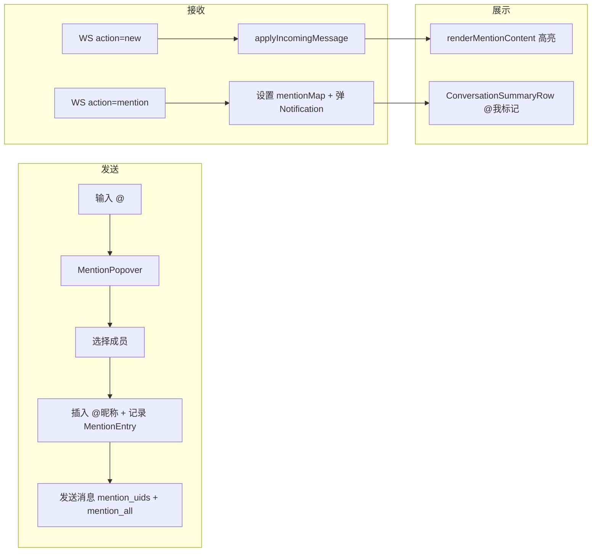

需求文档：[02-群聊@消息](../../requirements/02-群聊@消息.md)

# 群聊@消息 - 前端技术方案

## 一、需求分析

### 1.1 需求背景与目标

QIM 群聊缺少 @消息功能。需要在前端实现：输入 @触发成员选择 → 发送携带 mention_uids → 收到 mention 推送穿透免打扰 → 消息高亮 + 会话列表 @我标记。

### 1.2 现状分析

| 环节 | 现状 | 缺失 |
|------|------|------|
| MessageComposer | 无 @触发逻辑 | 缺 MentionPopover + mention 状态管理 |
| MessageDTO | 无 mention 字段 | 缺 `mention_uids` + `mention_all` |
| MessageBubble | 纯文本渲染 | 缺 @文本高亮 |
| ConversationSummaryRow | 无 @我标记 | 缺 mentionMap 状态 |
| realtimeModel | 只处理 `action="new"` | 缺 `action="mention"` 处理 |
| useChatStore | Notification 不检查 is_muted | 缺免打扰静默能力 |
| messageModel | 无 mention 判断 | 缺 `isMentionedMe` 函数 |

可复用的现有能力：
- `userCache`（用户信息缓存，用于 @昵称显示）
- `displayName()` 函数（UID → 显示名）
- `messageDisplayText()` 函数（会话列表预览文本）
- `RealtimeClient` 的 `send()` 方法（WS 信令发送）

## 二、系统概要设计

### 2.1 组件架构

```
ChatWindow
├── MessageComposer
│   └── MentionPopover (新增)        ← @触发时弹出
├── MessageList
│   └── MessageBubble (修改)         ← @文本高亮 + 被@标记
└── (现有组件不变)

ConversationList
└── ConversationSummaryRow (修改)     ← @我标记
```

### 2.2 数据流



### 2.3 状态管理

| 状态 | 位置 | 生命周期 |
|------|------|---------|
| `mentions: MentionEntry[]` | MessageComposer 组件内 | 发送后清空 |
| `mentionMode: boolean` | MessageComposer 组件内 | 选择成员/Escape 后退出 |
| `mentionMap: Record<number, boolean>` | ChatState（chatReducer） | markConversationRead 时清除；不持久化 |
| `MessageDTO.mention_uids` | 消息数据 | 随消息生命周期 |

`mentionMap` 不持久化到 localStorage，原因：
- 刷新页面后前端重新拉取会话列表，同时拉取未读消息
- 未读消息中包含 mention 的，重新 `applyIncomingMessage` 时会重新设置 `mentionMap`
- 已读的消息不需要保留 `@我` 标记
- 避免 localStorage 与服务器状态不一致的复杂同步问题

## 三、系统详细设计

### 3.1 组件设计

#### MentionPopover（新增）

触发条件：群聊输入框中输入 `@` 字符

```
位置：输入框上方，贴近光标位置
内容：群成员列表，支持搜索过滤
选项：@昵称 和 @全体成员（仅群主/管理员可见）
选择后：插入 @昵称 到输入框，记录 uid 到 mentions 列表

键盘交互：
  ↑/↓ 键：在成员列表中移动高亮
  Enter 键：选择当前高亮的成员
  Escape 键：关闭浮层，焦点回到输入框
  继续输入：浮层保持打开，实时过滤成员列表
```

Props：

```tsx
interface MentionPopoverProps {
  members: MemberDTO[];
  currentUID: number;
  isGroup: boolean;
  isAdmin: boolean;
  userCache: Record<number, UserDTO>;
  keyword: string;
  onSelect: (uid: number, displayName: string) => void;
  onSelectAll: () => void;
  onClose: () => void;
}
```

#### MessageComposer（修改）

新增 mention 状态管理：

```tsx
interface MentionEntry {
  uid: number;
  start: number;   // @符号在文本中的位置
  length: number;  // @昵称 的文本长度（含@符号）
}

const [mentions, setMentions] = useState<MentionEntry[]>([]);
const [mentionMode, setMentionMode] = useState(false);
const [mentionKeyword, setMentionKeyword] = useState('');
```

@触发逻辑：

```
监听 textarea 的 onChange：
  如果新输入的字符是 @ 且当前是群聊 → 进入 mention 模式
  mention 模式中继续输入 → 作为搜索关键词过滤成员列表
  选择成员 → 退出 mention 模式，插入 @昵称，记录 MentionEntry
  按 Escape → 退出 mention 模式
```

退格清理：

```tsx
function syncMentions(text: string, prevMentions: MentionEntry[]): MentionEntry[] {
  return prevMentions.filter(m => {
    const fragment = text.substring(m.start, m.start + m.length);
    return fragment.startsWith('@');
  });
}
```

每次 onChange 后调用 `syncMentions`，如果文本中对应位置不再是 `@` 开头，则移除该 mention 条目。全选删除时清空列表。

发送时携带 mention 信息：

```tsx
const mentionUIDs = mentions.map(m => m.uid);
const mentionAll = mentions.some(m => m.uid === 0); // @全体成员用 uid=0 在本地标记
onSend({ text, mention_uids: mentionUIDs.filter(uid => uid !== 0), mention_all: mentionAll });
setMentions([]); // 发送后清空
```

注意：`uid=0` 仅在前端本地作为 @全体的标记，发送时转为 `mention_all: true`，不传给后端。

#### MessageBubble（修改）

@文本高亮：使用 `renderMentionContent` 渲染消息内容，被 @自己的文本用特殊样式高亮。

被 @自己的标记：如果 `mention_uids` 包含当前用户 UID 或 `mention_all=true`，消息气泡显示小标记。

#### ConversationSummaryRow（修改）

会话列表中，如果最新消息 mention 了自己，显示 `"[有人@我]"` 前缀：

```
普通：张三: 你好
@我：[有人@我] 张三: @你 你好
@全体：[有人@我] 张三: @全体成员 你好
```

@我标记的清除时机：
- `@我` 标记只在 `unread_count > 0` 且最近一条未读消息命中 mention 时显示
- `markConversationRead` / 打开会话后清除
- 落到 `chatReducer` 走统一状态变更

### 3.2 Hook 设计

#### mentionMap 状态（chatReducer 扩展）

```tsx
interface ChatState {
  // ... 现有字段
  mentionMap: Record<number, boolean>;  // conversationID → 是否有@我
}
```

- `applyIncomingMessage` 时：如果消息的 `mention_uids` 包含当前用户或 `mention_all=true`，设置 `mentionMap[conversationID] = true`
- `markConversationRead` 时：清除 `mentionMap[conversationID]`

#### isMentionedMe 函数（messageModel 扩展）

```tsx
export function isMentionedMe(msg: MessageDTO, currentUID: number): boolean {
  if (msg.mention_all) return true;
  return !!msg.mention_uids?.includes(currentUID);
}
```

### 3.3 WS 协议

#### 上行：发送消息

```json
{
  "type": "message",
  "action": "send",
  "data": {
    "conversation_id": 1,
    "msg_type": 1,
    "content": "@张三 你好",
    "reply_to": 0,
    "client_id": "xxx",
    "mention_uids": [100, 200],
    "mention_all": false
  }
}
```

#### 下行：消息推送（action=new，所有成员）

```json
{
  "type": "message",
  "action": "new",
  "data": {
    "id": 123,
    "conversation_id": 1,
    "seq": 42,
    "sender_id": 50,
    "msg_type": 1,
    "content": "@张三 你好",
    "mention_uids": [100, 200],
    "mention_all": false,
    "reply_to": 0,
    "client_id": "xxx",
    "created_at": 1700000000
  }
}
```

#### 下行：@通知信号（action=mention，仅被 @者）

```json
{
  "type": "message",
  "action": "mention",
  "data": {
    "conversation_id": 1,
    "message_id": 123
  }
}
```

mention 推送仅是通知信号，不携带消息体，不触发 `applyIncomingMessage`，仅设置 mentionMap + 弹 Notification（免打扰也弹）。

### 3.4 类型定义

#### MessageDTO 扩展

```tsx
interface MessageDTO {
  // ... 现有字段
  mention_uids?: number[];
  mention_all?: boolean;
}
```

### 3.5 @文本解析协议

#### 问题

简单正则 `@后跟非空格` 无法处理：
- 包含空格的昵称
- 同名/部分匹配（"张三" vs "张三丰"）
- 多个 @同一人

#### 方案：mentions 段位信息

发送时不依赖文本解析，而是依赖 `mentions` 状态中的段位信息。渲染时同理：

```tsx
function renderMentionContent(content: string, mentionUIDs: number[], mentionAll: boolean, currentUID: number, members: MemberDTO[], userCache: Record<number, UserDTO>): ReactNode[] {
  if (!mentionUIDs?.length && !mentionAll) return [content];

  const uidNameMap = new Map<number, string>();
  for (const uid of mentionUIDs) {
    const name = displayName(uid, userCache);
    uidNameMap.set(uid, name);
  }

  const parts: ReactNode[] = [];
  let lastIndex = 0;
  for (const [uid, name] of uidNameMap) {
    const mentionText = `@${name}`;
    const idx = content.indexOf(mentionText, lastIndex);
    if (idx >= 0) {
      if (idx > lastIndex) parts.push(content.slice(lastIndex, idx));
      const isMe = uid === currentUID;
      parts.push(<span key={`${uid}-${idx}`} className={isMe ? 'mention-highlight-me' : 'mention-highlight'}>{mentionText}</span>);
      lastIndex = idx + mentionText.length;
    }
  }
  if (lastIndex < content.length) parts.push(content.slice(lastIndex));
  return parts;
}
```

**局限与后续**：当前方案仍依赖文本匹配 `@昵称`，对同名用户可能高亮错位。彻底解决需要后端在 content 中使用结构化标记（如 `@[u:100]`），但这会改变消息内容格式，本期不做。当前方案在大多数场景下可用，同名问题记录为已知限制。

### 3.6 免打扰基础能力

当前 `useChatStore.ts` 中 `new Notification` 不检查 `is_muted`，所有消息都弹通知。需要先建出免打扰静默能力：

```tsx
// applyIncomingMessage 中
if (!fromSelf && selectedIDRef.current !== next.conversation_id && !document.hasFocus()) {
  const conv = conversationsRef.current.find(c => c.conversation_id === next.conversation_id);
  const isMuted = conv?.is_muted ?? false;
  if (!isMuted) {
    try { new Notification('QIM 新消息', { body: messageDisplayText(next).slice(0, 50) }); } catch {}
  }
}
```

mention 推送不受 is_muted 影响，始终弹通知。

## 四、改动清单

| 文件 | 改动类型 | 说明 |
|------|---------|------|
| `components/chat/MentionPopover.tsx` | 新增 | @成员选择浮层 |
| `api/types.ts` | 修改 | `MessageDTO` 新增 `mention_uids` + `mention_all` |
| `components/chat/MessageComposer.tsx` | 修改 | @触发逻辑 + mention 状态管理 + 退格清理 + 发送携带 |
| `components/chat/MessageBubble.tsx` | 修改 | `renderMentionContent` 高亮 + 被 @标记 |
| `components/conversation/ConversationSummaryRow.tsx` | 修改 | @我标记显示 |
| `hooks/chat/models/realtimeModel.ts` | 修改 | 处理 `action="mention"` 推送 |
| `hooks/chat/models/messageModel.ts` | 修改 | 新增 `isMentionedMe` 函数 + `renderMentionContent` 函数 |
| `hooks/useChatStore.ts` | 修改 | 免打扰静默 + mention 推送触发 Notification |
| `hooks/chat/reducers/chatReducer.ts` | 修改 | `mentionMap` 状态 + markRead 清除 |

## 五、测试补充

| 测试文件 | 必补用例 |
|---------|---------|
| `messageModel.test.ts` | `isMentionedMe`（mention_all=true、mention_uids 包含/不包含自己、空数组） |
| `messageModel.test.ts` | `renderMentionContent`（无 mention、单个@、多个@、@自己高亮、同名用户） |
| `chatReducer.test.ts` | mentionMap 设置、markConversationRead 清除 |
| `realtimeModel.test.ts` | `action="mention"` 推送处理、不触发 applyIncomingMessage |

## 六、不改动

- 不新增页面/路由
- 不修改 `RealtimeClient` 的 WS 连接逻辑
- 不修改 `NavRail` / `RightPane` 等布局组件
- 不修改消息发送的 `msg_type`（@消息仍然是文本消息）
- 不做结构化文本标记（`@[u:100]`），同名高亮错位记录为已知限制
