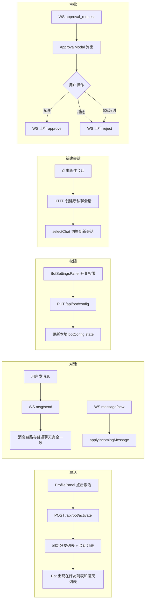

需求文档：[04-Agent Bot](../../requirements/04-Agent%20Bot.md)

# Agent Bot - 前端技术方案

## 一、需求分析

### 1.1 需求背景与目标

前端需为 Agent Bot 功能提供完整的交互体验：Bot 激活入口、好友列表中的 Bot 分组展示、Bot 私聊对话（含新建会话）、Bot 资料页及权限设置面板。Bot 的消息收发完全复用现有聊天链路，前端仅需增加 Bot 特有的 UI 差异。

### 1.2 现状分析

| 环节 | 现状 | 缺失 |
|------|------|------|
| 好友列表 | ContactsPanel 分「好友」「群聊」两 tab，FriendListSection 按分组展示 | 缺 Bot 分组展示，缺 Bot 特殊标识 |
| 会话列表 | ConversationList 展示所有私聊/群聊 | Bot 会话与普通私聊无异，缺区分入口 |
| 聊天窗口 | ChatWindow → MessageList + MessageComposer | 缺「新建会话」按钮（仅 Bot 会话显示） |
| 资料/设置 | ProfilePanel 展示个人信息 + 操作按钮 | 缺 Bot 激活入口、缺 Bot 权限面板 |
| UserDTO | 无 user_type 字段 | 缺 user_type 标识 bot 类型 |
| 消息链路 | RealtimeClient + applyIncomingMessage 完整 | 完全复用，Bot 消息即普通消息 |
| 审批通知 | 无 | 缺 `type:"agent"` WS 消息处理，缺审批弹窗组件 |

可复用的现有能力：
- `RealtimeClient` + WS 消息收发（Bot 消息走现有 `message/new` 推送）
- `ConversationList`（Bot 会话作为普通 `UserConvDTO` 展示）
- `MessageList` + `MessageComposer`（私聊对话体验）
- `SwitchRow` 组件（权限开关 UI）
- `displayName()`、`userCache` 等工具函数

## 二、系统概要设计

### 2.1 组件架构

```
App.tsx
├── ContactsPanel (修改)
│   └── FriendListSection
│       └── Bot 分组 (新增)          ← 独立分组，特殊图标
│           └── BotItem (新增)
│
├── ProfilePanel (修改)
│   ├── 激活 Bot 按钮 (条件渲染)
│   └── → 跳转 BotSettingsPanel
│
├── BotSettingsPanel (新增)            ← Bot 资料 + 权限面板
│   ├── Bot 头像/昵称（只读）
│   └── 权限开关列表（SwitchRow）
│
├── ChatWindow (修改)
│   └── MessageComposer
│       └── 新建会话按钮 (条件渲染)    ← 仅 Bot 会话显示
│
├── ApprovalModal (新增)               ← Bot 操作审批弹窗
│
└── ConversationSummaryRow (修改)
    └── Bot 图标标识                  ← 区分 Bot 会话
```

### 2.2 数据流



### 2.3 状态管理

| 状态 | 位置 | 生命周期 |
|------|------|---------|
| `botActivated: boolean` | useChatStore / chatReducer | 应用生命周期，从 HTTP API 获取 |
| `botUser: UserDTO | null` | useChatStore / chatReducer | 应用生命周期 |
| `botPermissions: string[]` | BotSettingsPanel 组件内 | 页面内，保存后回写 store |
| `isBotChat: boolean` | ChatWindow 内 derived | 由 `selectedConv.type` 派生（私聊 + 对方是 bot） |
| `approval: ApprovalRequest \| null` | useChatStore | 审批弹窗显示期间，操作后清空 |

不需要新的 chatReducer action——Bot 对话的未读、消息、会话列表等全部复用现有逻辑。

## 三、系统详细设计

### 3.1 组件设计

#### ContactsPanel（修改）

在「新的朋友」按钮下方、「好友/群聊」tab 上方，增加 Bot 分组入口：

```tsx
// Bot 分组：始终展示，点击进入 Bot 私聊或跳转激活
{bots.length > 0 ? (
  <div className="bot-section">
    <div className="section-header">智能助手</div>
    {bots.map(bot => (
      <div key={bot.id} className="contact-item bot-item"
           onClick={() => onSelectChat(bot.conversation_id)}>
        <Avatar src={bot.avatar} />
        <span>{bot.nickname}</span>
      </div>
    ))}
  </div>
) : (
  <button className="activate-bot-btn" onClick={onActivateBot}>
    激活 AI Bot
  </button>
)}
```

Bot 在好友列表中显示特殊 🤖 图标，始终在线。

#### ProfilePanel（修改）

在 ProfilePanel 底部或合适位置，增加激活 Bot 入口：

```tsx
// 条件渲染：未激活则显示激活按钮，已激活则显示"Bot 设置"入口
{botActivated ? (
  <button onClick={() => onViewBotSettings?.(botUser)}>
    AI Bot 设置
  </button>
) : (
  <button className="activate-bot-btn" onClick={onActivateBot}>
    激活 AI Bot
  </button>
)}
```

#### BotSettingsPanel（新增）

Bot 资料页，展示 Bot 基础信息 + 权限开关：

```tsx
interface BotSettingsPanelProps {
  botUser: UserDTO;
  permissions: string[];
  onTogglePermission: (perm: string) => void;
  onClose: () => void;
}
```

| 区域 | 内容 |
|------|------|
| 顶部 | Bot 头像（只读默认头像）、昵称（只读默认昵称） |
| 权限列表 | `SwitchRow` 组件逐项展示，开关即时生效 |

权限列表渲染：

```tsx
const PERMISSION_ITEMS = [
  { key: 'friend:read', label: '查看好友列表', desc: '允许 Bot 读取您的好友信息' },
  { key: 'conversation:read', label: '查看好友会话', desc: '允许 Bot 读取私聊会话记录' },
  { key: 'group:read', label: '查看群聊信息', desc: '允许 Bot 读取群聊基本信息' },
  { key: 'message:search', label: '查看聊天记录', desc: '允许 Bot 搜索和引用历史消息' },
];

// 渲染
{PERMISSION_ITEMS.map(item => (
  <SwitchRow
    key={item.key}
    label={item.label}
    description={item.desc}
    checked={permissions.includes(item.key)}
    onChange={() => onTogglePermission(item.key)}
  />
))}
```

点击开关 → PUT `/api/bot/config` → 成功后更新本地 `permissions` 状态。

#### MessageComposer（修改）

当 `isBotChat` 为 true 时，在输入框上方或工具栏显示「新建会话」按钮：

```tsx
{isBotChat && (
  <button className="new-session-btn" onClick={onNewSession}>
    + 新建会话
  </button>
)}
```

新建会话流程：
1. 点击按钮 → HTTP 请求创建新的私聊会话（用户 ↔ Bot）
2. 获得新 `conversation_id` → `selectChat(newConvID)` 切换到新会话
3. 旧会话保留在会话列表中

#### ConversationSummaryRow（修改）

Bot 会话行显示 Bot 图标前缀，在线状态始终为"在线"。

#### ApprovalModal（新增）

Bot 发起 `request_approval` 时前端弹出审批确认框：

```tsx
interface ApprovalRequest {
  approval_id: string;
  bot_uid: number;
  conversation_id: number;
  action: string;       // 操作名称，如 "创建提醒"
  detail: string;       // 操作详情，如 "提醒内容：5分钟后吃饭"
  timeout_seconds: number;
}

interface ApprovalModalProps {
  request: ApprovalRequest;
  onApprove: (approvalId: string) => void;
  onReject: (approvalId: string) => void;
  onTimeout: () => void;
}
```

交互：
- 居中 Modal 弹窗，标题「Agent 操作确认」
- 内容：`「{action}」—— {detail}，允许吗？`
- 两个按钮：允许（绿色）/ 拒绝（红色）
- 启动 `timeout_seconds` 倒计时，显示剩余秒数
- 超时自动调用 `onTimeout`（等同于 reject）
- 操作后调用 `onApprove` 或 `onReject`，关闭弹窗

### 3.2 WS 协议（审批）

审批通知走现有 WS 链路，`type:"agent"` 为新增的消息类型：

```json
// 下行：用户端收到审批请求
{"type":"agent","action":"approval_request","data":{
  "approval_id":"uuid",
  "bot_uid":100,
  "conversation_id":5,
  "action":"创建提醒",
  "detail":"提醒内容：5分钟后吃饭",
  "timeout_seconds":60
}}

// 上行：用户操作
{"type":"agent","action":"approve","data":{"approval_id":"uuid"}}
{"type":"agent","action":"reject","data":{"approval_id":"uuid"}}
```

`useChatStore` 的 WS 消息分发中新增分支：

```tsx
// realtimeModel 或 useChatStore 的 push handler 中
case 'agent':
  if (msg.action === 'approval_request') {
    setApproval(msg.data as ApprovalRequest);
  }
  break;
```

### 3.3 Hook 设计

#### botModel.ts（新增）

```tsx
// hooks/chat/models/botModel.ts

export async function activateBot(http: HttpClient): Promise<{ botUser: UserDTO; convID: number }> {
  const res = await http.post('/api/bot/activate');
  return { botUser: res.data.bot_user, convID: res.data.conversation_id };
}

export async function getBotConfig(http: HttpClient): Promise<BotConfig> {
  const res = await http.get('/api/bot/config');
  return res.data;
}

export async function updateBotPermissions(http: HttpClient, permissions: string[]): Promise<void> {
  await http.put('/api/bot/config', { permissions });
}

export async function newBotSession(http: HttpClient): Promise<number> {
  const res = await http.post('/api/bot/session');
  return res.data.conversation_id;
}
```

#### useChatStore 集成

在 store 中新增 bot 相关状态和操作：

```tsx
// 新增状态
const [botUser, setBotUser] = useState<UserDTO | null>(null);
const [botPermissions, setBotPermissions] = useState<string[]>([]);

// 在 refreshBase() 中增加：检查是否有绑定的 bot 用户
// 如果 UserDTO 中有 user_type 或通过 API 查询

// 新增方法
const activateBot = async () => {
  const { botUser, convID } = await activateBot(http);
  setBotUser(botUser);
  await refreshBase(); // 刷新好友列表 + 会话列表
  selectChat(convID);
};

const toggleBotPermission = async (perm: string) => {
  const next = botPermissions.includes(perm)
    ? botPermissions.filter(p => p !== perm)
    : [...botPermissions, perm];
  await updateBotPermissions(http, next);
  setBotPermissions(next);
};

const newBotSession = async () => {
  const convID = await newBotSession(http);
  await refreshBase();
  selectChat(convID);
};
```

### 3.4 类型定义

```tsx
// api/types.ts

export interface UserDTO {
  // ... 现有字段
  user_type?: number;  // 新增：0=normal, 1=bot
}

export interface BotConfig {
  uid: number;
  permissions: string[];
}

export interface ApprovalRequest {
  approval_id: string;
  bot_uid: number;
  conversation_id: number;
  action: string;
  detail: string;
  timeout_seconds: number;
}

// types/index.ts — 无需新增类型
// ModalState 可能扩展 bot-settings
```

### 3.5 HTTP API

全部需要 Auth 中间件（复用现有 JWT）。

| 端点 | 方法 | 说明 |
|------|------|------|
| `/api/bot/activate` | POST | 激活 Bot，返回 botUser + conversation_id |
| `/api/bot/config` | GET | 获取 Bot 配置 |
| `/api/bot/config` | PUT | 更新 Bot 权限 `{permissions: [...]}` |
| `/api/bot/session` | POST | 创建新的 Bot 私聊会话，返回 conversation_id |

### 3.6 视觉规范

- Bot 在好友列表中：始终显示"在线"状态（绿色圆点），🤖 图标前缀
- Bot 在会话列表中：会话头像使用 Bot 默认头像
- Bot 消息气泡：与普通消息一致（无需特殊样式）
- 新建会话按钮：置于 MessageComposer 工具栏，图标 `+` 带文字"新建会话"

## 四、改动清单

| 文件 | 改动类型 | 说明 |
|------|---------|------|
| `api/types.ts` | 修改 | `UserDTO` 新增 `user_type`；新增 `BotConfig` 类型 |
| `components/contacts/ContactsPanel.tsx` | 修改 | 新增 Bot 分组区块（激活按钮 / Bot 列表项） |
| `components/user/ProfilePanel.tsx` | 修改 | 新增「激活 AI Bot」/「Bot 设置」入口按钮 |
| `components/chat/BotSettingsPanel.tsx` | ★新增★ | Bot 资料页：只读信息 + SwitchRow 权限列表 |
| `components/chat/MessageComposer.tsx` | 修改 | 新建会话按钮（条件渲染，仅 Bot 会话） |
| `components/conversation/ConversationSummaryRow.tsx` | 修改 | Bot 图标标识、在线状态 |
| `hooks/chat/models/botModel.ts` | ★新增★ | Bot 相关 API 调用封装 |
| `components/chat/ApprovalModal.tsx` | ★新增★ | Bot 操作审批弹窗（允许/拒绝/超时） |
| `hooks/useChatStore.ts` | 修改 | botUser/botPermissions/approval 状态 + activateBot/toggleBotPermission/newBotSession 方法 + WS approval_request 处理 |
| `hooks/chat/types.ts` | 修改 | ChatStoreDeps 新增 bot 相关字段 |
| `App.tsx` | 修改 | BotSettingsPanel + ApprovalModal 集成 |
| `components/ui/Modal.tsx` | 修改 | ModalState 类型扩展 `agent-approval` |

## 五、测试补充

| 测试文件 | 必补用例 |
|---------|---------|
| `botModel.test.ts` | `activateBot` 正常/已激活拒绝；`getBotConfig`；`updateBotPermissions` |
| `chatReducer.test.ts` | botUser 设置、botPermissions 更新、approval 状态 |
| 组件 | BotSettingsPanel 权限开关；ApprovalModal 允许/拒绝/超时 |

## 六、不改动

- 不修改 `RealtimeClient` 的 WS 连接逻辑（Bot 消息走现有链路）
- 不修改 `MessageList`、`MessageBubble`（Bot 消息与普通消息 UI 一致）
- 不修改 `NavRail`、`RightPane` 布局组件
- 不新增路由（Bot 设置走现有 modal/right pane 模式）
- 不做 Bot 头像/昵称自定义
- 不做「删除 Bot」功能
- 不做审批历史记录

## 七、预估工时

| 模块 | 内容 | 工时 |
|------|------|------|
| Bot 激活入口 | ProfilePanel + ContactsPanel 条件渲染、HTTP 对接 | 1 天 |
| BotSettingsPanel | Bot 资料展示 + SwitchRow 权限列表 | 1 天 |
| 新建会话 | MessageComposer 按钮 + HTTP 创建私聊会话 | 0.5 天 |
| Bot 视觉标识 | ConversationSummaryRow 图标、ContactsPanel Bot 分组、在线状态 | 0.5 天 |
| useChatStore 集成 | botUser/permissions/approval 状态 + 方法、WS 消息分发 | 1.5 天 |
| 联调 + 测试 | 与后端 bot HTTP/WS API 联调 + 组件/单测 | 1 天 |
| **合计** | | **6 天** |
